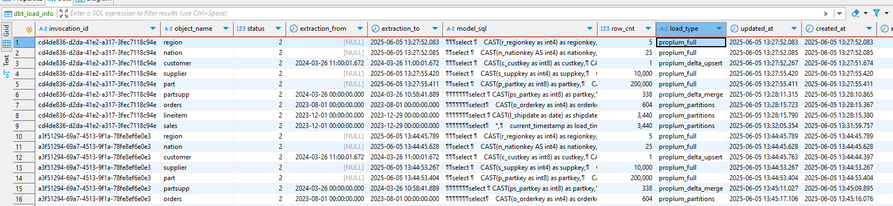
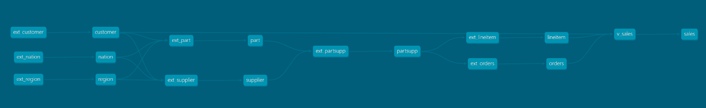
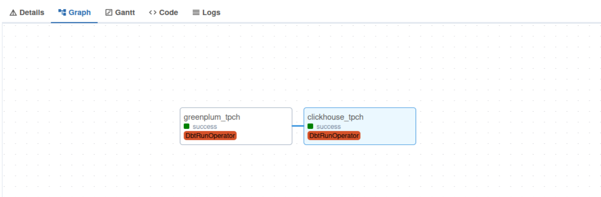

# DBT Proplum: современный инструмент для работы с Greenplum и ClickHouse
### Введение
В современных реалиях все чаще встает вопрос про переход с вендорских продуктах на open-source. Но в вендорских продуктах есть инструменты моделирования объектов и etl, которые при переходе на open-source теряются.  Приходится выдумывать свое решение или искать решения внутри того же open-source, который не всегда адаптирован под конкретные СУБД. Две часто используемые СУБД:  Greenplum - мощная MPP (Massively Parallel Processing) СУБД, которая не уступает по производительности зарубежным аналогам и поддерживается российскими вендорами, например, Arenadata DB (ADB) и Clickhouse - колоночная аналитическая СУБД с открытым кодом, позволяющая выполнять аналитические запросы в режиме реального времени на структурированных больших данных.

Но как быстро и эффективно начать миграцию на Greenplum или ClickHouse, сохранив привычные инструменты и подходы? В этой статье я расскажу о DBT Proplum - адаптере для DBT ([Data Build Tool](https://docs.getdbt.com/)), который расширяет возможности работы с Greenplum и ClickHouse, добавляя новые стратегии загрузки данных, логирование и интеграцию с внешними источниками.

### Что такое DBT (Data Build Tool)?
DBT (Data Build Tool) - это популярный инструмент для трансформации данных в современных хранилищах. Он позволяет:

* Описывать бизнес-логику на SQL (или Python в dbt-core 1.5+).
* Автоматизировать сборку моделей с зависимостями (DAG).
* Тестировать данные на целостность и соответствие правилам.
* Документировать метаданные для прозрачности процессов.

DBT не занимается загрузкой сырых данных (это задача ETL-инструментов), а фокусируется на преобразовании уже загруженной информации в аналитические модели.

Но сейчас существуют проблемы с текущим адаптером для Greenplum в DBT. Официальный [адаптер Greenplum](https://docs.getdbt.com/docs/core/connect-data-platform/greenplum-setup) для DBT не обновлялся более 2 лет и из-за этого не поддерживает актуальные версии DBT Core. Также адаптер никак не использует функциональность партиций для загрузок инкремента. Мы взяли данный адаптер как основу и добавили свою новую функциональность DBT Proplum к нему.

### Что такое DBT Proplum?
DBT Proplum - это адаптер для DBT Core, который добавляет специализированные материализации и стратегии загрузки данных, оптимизированные для Greenplum и ClickHouse. Он позволяет:

* Автоматизировать загрузку данных с поддержкой дельта-загрузок, полных обновлений и работы с партициями.
* Логировать выполнение процессов в базе данных, что упрощает мониторинг и отладку.
* Интегрироваться с внешними источниками через механизм внешних таблиц (external tables).
* Использовать расширенные стратегии инкрементальной загрузки.

**Ключевые особенности**:
* Полная совместимость с DBT Core - все стандартные функции DBT работают.
* Поддержка Greenplum и ClickHouse - оптимизированные стратегии загрузки для MPP-архитектуры.
* Автоматическое управление дельта-загрузками - расчёт интервалов, проверка дубликатов, обновление статистики.
* Гибкость работы с партициями - замена, слияние или полная перезапись партиций.
* Интеграция с внешними системами - поддержка создания внешних таблиц.

| Функциональность             | Текущая DBT функциональность                  |    Функциональность Proplum                    |
|------------------------------|-----------------------------------------------|------------------------------------------------|
| **Логирование**              | ❌ Никакого логирования внутри БД               | ✔️ Логирование процессов работы DBT внутри СУБД    |
| **Определение периода дельты загрузки**  | Требуется ручное определение пользователем               | ✔️ Автоматическое определение                        |
| **Поддержка партиций**       | Только при создании таблиц                      | ✔️ Дополнительная функциональность:                           |
|                              |                                               | - Использование подмены партиций при загрузке дельты     |
|                              |                                               | - Автоматическое создание дополнительных партиций   |
| **Бекап таблиц БД**          | ❌ Бекап не сохраняется в БД                  | ✔️ Автоматический бекап таблиц для случая фулл загрузок  |
| **Новые методы инкрементальных загрузок**| ❌ Минимальный набор методов      | ✔️ Добавленные новые методы с функциональностью:            |
|                              |                                               | - Загрузка дельты с подменой партиций               |
|                              |                                               | - Партициниорование внешних таблиц в периоде загрузки дельты   |
| **Интеграция внешних таблиц**| ❌ Не используется                           | ✔️ Поддерживает новый метод материализации моделей `external_table`    |
| **Обработка качества данных**  | Стандартный набор                          | ✔️ Добавлены проверки:                            |
|                              |                                               | - Проверка дубликат в ключах     |
|                              |                                               | - Отслеживания количества пришедших данных              |

### Логирование

При работе загрузок внутри DBT Proplum каждый прогон модели выполняет сохранение логов загрузки в базу данных. Пример логов:  


Главные поля в таблице логов:
1) invocation_id. ID выполнение прогона модели в dbt. По этому ID можно найти логи внутри самого DBT.
2) object_name. Имя модели, для который выполнялась загрузка.
3) status. 1 - при начале загрузке модели, 2 - после завершения загрузки.
4) extraction_to. Дата, до которой выполнялась загрузка модели. Используется для построения дельта периода для последующих загрузок. 
5) model_sql. SQL, который выполнялся для забора новых данных. 
6) load_type. Имя стратегии загрузки, которая использовалась для загрузки модели.
7) row_cnt. Количество строк в обрабатываемых новых данных 

### Внешние таблицы

Одной из ключевых возможностей DBT Proplum является работа с внешними таблицами (external tables), что особенно полезно при организации загрузок из внешних систем.

Пример модели внешней таблицы:
```sql
{{ config(
    materialized='external_table',
    connect_string="pxf://path/to/data",
    columns="""
    id int8,
    name text,
    created_at timestamp
    """
) }}
```

При создании внешних таблиц также поддерживается параметры, которые работая вместе с настройкой дельты целевой таблицы, партицируют данные внешней таблицы в периоде дельты загрузки для лучшей производительности загрузки. 

### Основные стратегии загрузки в Greenplum

В оригинальном адаптере для Greenplum существовали 3 алгоритма для загрузки инкремента: `append`, `delete+insert`,  `truncate+insert`. DBT Proplum добавляет дополнительно 5 новых режима загрузки данных:

| Функциональность              | **FULL** | **DELTA UPSERT** | **DELTA MERGE** | **DELTA** | **PARTITIONS** |
|-----------------------|---------------|-------------------------------|-----------------------------|-----------------|----------------------------------------|
| **Короткое описание алгоритма**    | Удаляются данные из таблицы, вставляются новые данные. Аналогичен truncate+insert методу с добавленным логированием загрузок. | Из целевой таблицы удаляются, которые пересекаются по ключу с пришедшими новыми данными. Вставляются новые данные. Аналогичен delete+insert методу с добавленным логированием загрузок. | Используется в таблицах, где есть партиция по умолчанию. Новые и уже существующие данные в таблице комбинируются в буферную таблицу, буферная таблица затем заменяет партицию по умолчанию  | Вставка пришедших новых данных в дельте с автоматическом расширением интервала партицирования. | Аналогично алгоритму **DELTA** создаются новые партиции. Новые данные в зависимости от настройки модели либо комбинируются с уже существующими данными или берутся как есть. Выполняется замена партиций для каждой партиций, которая затронута новыми данными. |
| **Подходит для**          | Малых таблиц справочников | Таблиц измерений, в которых могут происходить небольшие изменения данных | Больших таблиц измерений | Получение срезов данных или для таблиц с кумулятивной дельтой | Для партицированных таблиц фактов |


### Пример реализации дельта-загрузки через внешние таблицы с использованием стратегии PARTITIONS

Рассмотрим практический пример загрузки данных из внешнего источника в партиционированную таблицу Greenplum с использованием стратегии PARTITIONS.

#### 1. Создаем модель для внешней таблицы

```sql

-- models/staging/ext_sales.sql
{{
  config(
    materialized='external_table',
    connect_string="pxf://data/sales?PROFILE=s3:parquet",
    load_method='pxf', -- Использует PXF для чтения данных из S3
    model_target='sales_fact',
    delta_field='sale_date',  -- Поле для дельта-загрузки
    safety_period='2 days',  -- Учет опоздавших данных
    columns="""
    order_id bigint,
    sale_date timestamp,
    amount numeric(18,2),
    """
  )
}}

```

#### 2. Создаем целевую партиционированную таблицу

```sql

-- models/dwh/sales_fact.sql

PARTITION BY RANGE (sale_date)
(
    START ('2023-01-01'::timestamp) END ('2023-02-01'::timestamp) 
    EVERY (INTERVAL '1 month'),
    DEFAULT PARTITION extra
)


{{
  config(
    materialized='proplum',
    incremental_strategy='partitions',
    delta_field='sale_date',
    merge_partitions=true, --флаг, что мы объединяем новые данные из дельты с уже существующими данными в целевой таблице (при false данные из целевой таблицы удаляются если они не пришли в дельте) 
    merge_keys=['order_id'],  --ключ таблицы 
    raw_partition=partition_def,
    fields_string="""
    order_id bigint,
    sale_date timestamp,
    amount numeric(18,2),
    """
  )
}}

SELECT * FROM {{ ref('ext_sales') }}

```

**Как это работает:**

1. Внешняя таблица (ext_sales):
   * Автоматически партицирует данные по дате (sale_date), согласно последней выполненной загрузки в sales_fact. В результирующей созданной внешней таблице будет добавлено выражение вида: 'PARTITION_BY=sale_date:date&RANGE=2023-12-01:2025-07-02&INTERVAL=36:day'. При необходимости загрузку в dbt можно также запустить с переменными start_date и end_date для точечной перегрузки данных.
   * Учитывает "опоздавшие" данные (safety_period='2 days')
   * Использует протокол PXF для чтения данных.

2. Целевая таблица (sales_fact):

   Создается с помесячным партицированием

   При дельта-загрузке:
      * Накладывается фильтр на поле sale_date с датами, аналогичными ограничению для внешней таблицы (sale_date BETWEEN '2023-12-01 00:00:00'::timestamp AND '2025-07-02 00:00:00'::timestamp).
      * Автоматически создает новые партиции при необходимости
      * Для существующих партиций объединяет старые и новые данные и сохраняет только последнюю версию строки для каждого order_id

Общая схема процесса загрузки данных:

```mermaid
---
title: Процесс загрузки Sales_fact 
---
flowchart LR
    A[Начало] --> AA[Создаем внешнею таблицу ext_sales]
    AA --> B[Создание дельты таблицы]
    B --> C[Выполняется селект из модели sales_fact в таблицу дельту]
    C --> F[Создаются недостающие партиции в таблице sales_fact в дельте периоде]
    F --> G[Выполняем цикл по партициям внутри таблицы sales_fact в дельте периоде]
    G --> H[Создаем буферную таблицу]
    H --> I[Вставляем данные из таблицы дельты и sales_fact за период партиции в буферную таблицу]
    I --> K[ПОдменяем партицию в таблице sales_fact на буферную таблицу]
    K --> L[Конец цикла]
    L --> G
    L --> M[Выполняем Analyze sales_fact таблицы]
    M --> N[Записываем результат в таблицу логов]
    N --> O[Конец]
```


**Преимущества подхода**:

1. Эффективность:
   * Загружаются только новые/измененные данные
   * Вместо вставки новых данных напрямую в таблицу, выполняется подмена партиций. Это позволяет уменьшить время блокировки таблицы
   * Возможность переключения между merge/overwrite режимами
   * Перегрузка инкремента за произвольные интервалы при необходимости
2. Надежность:
   * Автоматическое ведение логов
   * Встроенная обработка опоздавших данных


### Основные стратегии загрузки в Clickhouse

В стандартном адаптере Clickhouse для DBT реализованы 4 алгоритма для загрузки инкремента: `append`, `delete+insert`,  `insert_overwrite`, `microbatch`. DBT Proplum добавляет дополнительно 3 новых режима загрузки данных:

| Функциональность               | **FULL** | **DELTA UPSERT**  | **PARTITIONS** |
|-----------------------|---------------|--------------------------------|----------------------------------------|
| **Короткое описание алгоритма**    | Обмен таблицы модели с таблицей с новыми данными. |  Удаляются данные, которые пересекаются по ключу с пришедшими новыми данными. Вставляются новые данные. | Новые данные в зависимости от настройки модели либо комбинируются с уже существующими данными или берутся как есть. Выполняется подмена партиций для каждой партиций, которая затронута новыми данными. |
| **Подходит для**          | Малых таблиц справочников | Таблиц измерений, в которых могут происходить обновление данных  | Для партицированных таблиц фактов |


### Оркестрация DBT-моделей в Airflow

Одним из ключевых преимуществ DBT Proplum является его бесшовная интеграция с оркестраторами, такими как Apache Airflow. 

Для работы dbt с airflow мы используем библиотеку airflow_dbt. Эта библиотека позволяет выполнять операции dbt как шаги дага. Например, мы можем с выполнять всем модели одного тага на схеме:


В один шаг (greenplum_tpch) дага:




А последующий шаг (clickhouse_tpch) позволяет сразу же после выполнение трансформаций в Greenplum обновить данные в Clickhouse.

Преимущества такого подхода:

Гибкость: Выполнение моделей можно ставить на расписание. Можно запускать как отдельные модели (--select model_name), так и целые слои (--select tag:ods). При использование тага в селекте аналитик может добавлять модели в загрузку не меняя даг. 

Надёжность: Airflow перезапускает упавшие задачи и уведомляет о проблемах.

Масштабируемость: Подходит как для небольших загрузок, так и для сложных ETL-цепочек.

### Заключение
DBT мощный инструмент по генерации таблиц и трансформации данных в СУБД. Дополнения, сделанные в DBT Proplum, расширяют функциональность работы DBT для аналитических баз Greenplum и ClickHouse. Эти дополнения:

* Упрощают миграцию с других СУБД за счёт поддержки внешних таблиц.

* Добавляют дополнительные стратегии загрузок, заточенные под специфику баз  Greenplum и ClickHouse.

* Логируют все шаги выполнения DBT внутри СУБД. 

Проект доступен в открытом [исходном коде](https://gitlab.sapiens.solutions/proplum/dbt-adapter/-/tree/greenplum_dev?ref_type=heads), и мы приглашаем сообщество к сотрудничеству!

### Вебинар
Если вас заинтересовал наш инструмент, приглашаем посмотреть [запись вебинара](https://sapiens.solutions/webinar-framework?utm_source=habr), посвященного демонстрации работы с фреймворком на живых данных.

### Ссылка на github:

[GitHub DBT Proplum](https://gitlab.sapiens.solutions/proplum/dbt-adapter/-/tree/greenplum_dev?ref_type=heads)

Теги:
#Greenplum #ClickHouse #DBT #ETL #DataEngineering #OpenSource

Хабы: [Блог компании Sapiens solutions](https://habr.com/ru/companies/sapiens_solutions/articles/), [Data Engineering](https://habr.com/ru/hubs/data_engineering/), [Хранилища данных](https://habr.com/ru/hubs/data_warehouse/), [Open Source](https://habr.com/ru/hubs/open_source/)