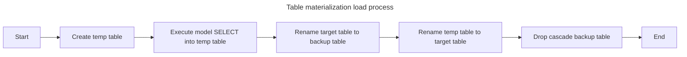
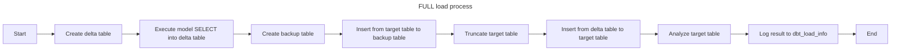
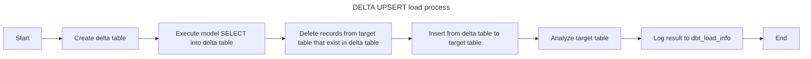
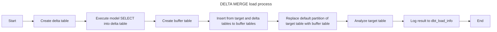
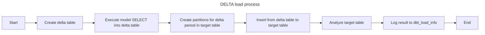
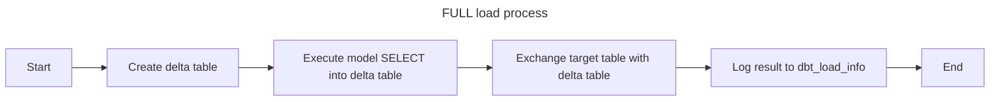
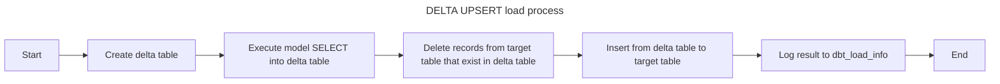
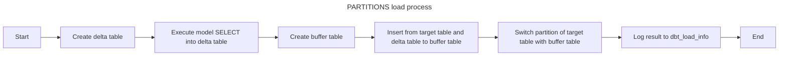

# DBT Proplum
- [DBT Proplum](#dbt-proplum)
- [Greenplum](#greenplum)
  - [Overview](#overview)
  - [Installation](#installation)
  - [Current DBT Workflow ](#current-dbt-workflow-)
    - [Full Loads ](#full-loads-)
    - [Incremental Loads](#incremental-loads)
  - [Proplum Features](#proplum-features)
    - [dbt\_load\_info](#dbt_load_info)
    - [External View](#external-view)
      - [Standard External Table](#standard-external-table)
      - [Enhanced for delta load format](#enhanced-for-delta-load-format)
  - [New incremental strategies](#new-incremental-strategies)
    - [Incremental Strategies Comparison](#incremental-strategies-comparison)
    - [FULL](#full)
    - [DELTA UPSERT](#delta-upsert)
    - [DELTA MERGE](#delta-merge)
    - [DELTA](#delta)
    - [PARTITIONS](#partitions)
    - [Configuring the Loading Chain](#configuring-the-loading-chain)
- [Clickhouse](#clickhouse)
  - [Overview](#overview-1)
  - [Proplum Features](#proplum-features-1)
    - [dbt\_load\_info](#dbt_load_info-1)
    - [External View](#external-view-1)
    - [New incremental strategies](#new-incremental-strategies-1)
      - [FULL](#full-1)
      - [DELTA UPSERT](#delta-upsert-1)
      - [PARTITIONS](#partitions-1)

# Greenplum
## Overview

The DBT Proplum adapter enables modern data transformation workflows on Greenplum databases by:

- Providing compatibility with the latest DBT Core versions
- Extending Greenplum functionality with two specialized materializations:
  1. **external_table**: For optimized external data source integration
  2. **proplum**: Enhanced loading strategies with delta load capabilities

Key features include:

✔ **Comprehensive Run Logging** - Tracks all DBT operations directly in Greenplum  
✔ **Smart Delta Management** - Automatically calculates and adjusts load windows  
✔ **High-Performance Loading** - Optimized workflows for:
   - External table integration
   - Partitioned table operations  

✔ **Advanced Strategies** - Specialized incremental approaches for different table types and use cases

The adapter maintains all standard DBT functionality while adding these Greenplum-specific enhancements, making it ideal for complex ETL/ELT pipelines on large datasets.

| Feature                      | Native DBT Strategies                          | Proplum Strategies                              |
|------------------------------|-----------------------------------------------|------------------------------------------------|
|                              | `append` \| `delete+insert` \| `truncate+insert` | `FULL` \| `DELTA` \| `DELTA_UPSERT` \| `DELTA_MERGE` \| `PARTITIONS` |
| **Logging**                  | ❌ No native Greenplum logging               | ✔️ Comprehensive logging in `dbt_load_info`    |
| **Delta Window Management**  | Manual implementation required                | ✔️ Automatic calculation                        |
| **Partition Support**        | Basic (via raw SQL)                           | ✔️ Advanced features:                           |
|                              |                                               | - Partition-aware delta loading                |
|                              |                                               | - Merge/replace modes for partitions loading   |
| **Backup Mechanism**         | ❌ No built-in backup                         | ✔️ Automatic backup table creation in case of full loads  |
| **Performance Optimizations**| Standard DBT execution                        | ✔️ Greenplum-specific enhancements:            |
|                              |                                               | - Load delta by replacing partition               |
|                              |                                               | - Partition external table before loading to target table     |
|                              |                                               | - Load with update of existing rows            |
| **External Table Integration**| ❌ Not integrated                           | ✔️ Supports new materialization `external_table`        |
| **First Load Handling**      | Treated as full refresh                       | ✔️ Special 'init' mode with logging            |
| **Data Validation**          | Manual checks required                        | ✔️ Built-in checks:                            |
|                              |                                               | - Duplicate detection (`delete_duplicates`)    |
|                              |                                               | - Row count tracking (`row_cnt`)               |


## Installation

Run the following commands in your terminal:
```bash
pip install setuptools  
pip install .  # Run this in the folder containing the DBT Proplum adapter
dbt init     # Run this in the folder where you want to create the DBT project
```
Add the following variable settings to your dbt_project.yml file (located in your DBT project folder):
```yml
vars:
  load_info_config:
    default:
      table: "dbt_load_info"
      schema: "dbt_etl"
    <<name of additional targets in profiles>>:
      table: "dbt_load_info"
      schema: "dbt_etl_2"
```
These settings configure the name and schema for the dbt_load_info table, which stores Proplum loading logs. You can specify different names and schemas for each target configured in your profiles file.

Notes:
* If no parameters are set for a specific target, the default parameters will be used
* If no default is specified, the system will use schema = 'dbt_etl' and table = 'dbt_load_info'

After configuring these parameters, execute the following command to create the dbt_load_info table (run this in your project folder):
```bash
dbt run-operation proplum_create_load_info_table
```

## Current DBT Workflow <a name="current_dbt"></a>
This section describes how loading processes work without proplum features.
### Full Loads <a name="full_load"></a>

<details>
  <summary>Example Model File</summary> 

```SQL
    
        id int4 null,
        descrip varchar(150) null,
        incomingdate timestamp NULL
    


    
        PARTITION BY RANGE (incomingdate)
        (
            START ('2025-04-01'::timestamp) INCLUSIVE
            END ('2025-04-03'::timestamp) EXCLUSIVE
            EVERY (INTERVAL '1 day'),
            DEFAULT PARTITION extra
        )
    
    {{
    config(
        materialized='table',
        schema='dbt',
        distributed_by='id',
        appendoptimized=true,
        orientation='column',
        compresstype='ZLIB',
        compresslevel=1,
        fields_string=fields_string,
        raw_partition=raw_partition
    )
    }}

    with source_data as (

        select 1 as id, 'apple' as descrip, '2022-04-01'::timestamp as part_date
        union all
        select 2 as id, 'banana' as descrip, '2025-04-02'::timestamp as part_date

    )

    select *
    from source_data
```
</details>

During a full table load operation, the following steps occur:
  1. A *__dbt_tmp table is created with the structure specified in the model.
  2. The SELECT statement written in the model is executed, and the data is inserted into the *__dbt_tmp table. (If there are no partitions in the table, the table is created as a SELECT statement, not as a separate operation).
  3. The model table is renamed to *__dbt_backup.
  4. The *__dbt_tmp table is renamed to the model table. If there are field descriptions, comments are added to the fields after renaming.
  5. A DROP CASCADE is executed for the *__dbt_backup table.

For the first load, when the table does not yet exist in the database, steps 3 and 5 are skipped. 



The following parameters are filled in the configuration:
  1. materialized - Set to 'table' for tables. Other possible values: 'view', 'materialized view', 'ephemeral' (not created in the database but used in SELECT statements of other models), 'incremental' (for incremental loads, described in more detail below).
  2. schema - The schema in which the model is created. If the parameter is not set, the table is created in the schema to which the connection was established when the DBT project was created.
  3. appendoptimized, orientation, compresstype, compresslevel, blocksize - Parameters specific to Greenplum. The parameters orientation, compresstype, compresslevel, blocksize are applied only if appendoptimized = true. For convenience, parameters can be filled in the dbt_project file for all models in a folder. For example:
```YML
models:
  projectname:
    # Config indicated by + and applies to all files under models/example/
    example:
      +compresstype: ZSTD
      +compresslevel: 1
      +appendoptimized: true
```
  4. distributed_by, distributed_replicated - Distribution parameters. Mutually exclusive parameters (if both are filled, priority is given to distributed_by). The distributed_by field specifies the fields for distribution in the table. If there are multiple fields, they are listed with ',' as a text parameter. For example: 'column1, column2'. distributed_replicated is set to true if the table needs to be replicated in the database. If neither parameter is filled, the distribution is random.
  5. fields_string, raw_partition - Table partition settings. raw_partition specifies partition settings as SQL when creating the table in the database. fields_string must be filled if partitioning is used in the model and contains a list of all fields in the table with syntax as in CREATE TABLE. Instead of raw_partition, the following parameters can also be used: partition_type, partition_column, default_partition_name, partition_start, partition_end, partition_every, partition_values. These parameters can also configure table partitions, but raw_partition is more straightforward.

  >[!NOTE]
  > `fields_string` can be omitted in the model description, but this may affect performance. Without `fields_string`, a temp table is first created from the written SQL, based on which the target table is created, and data from the temp table is inserted into the target. With `fields_string`, data from the written SQL is inserted directly into the target table without creating a temp table.

### Incremental Loads

<details>
  <summary>Example Model File</summary> 

```SQL
    {{
    config(
        materialized='incremental',
        schema='dbt',
        appendoptimized=true,
        orientation='row',
        compresstype='ZSTD',
        compresslevel=1,
        incremental_strategy='append' 
    )
    }}

    select * from {{ ref('delta_exter') }}
    
    WHERE 1=1
    
```
</details>

For incremental loading, materialized='incremental' must be specified instead of 'table'. The loading logic depends on the selected incremental_strategy (by default, the append logic is used if the unique_key parameter is not filled. If unique_key is filled, delete+insert is used). The first time the model is executed (when the model table does not yet exist in the database), the logic follows a full load. On subsequent executions, the selected incremental logic is applied. To distinguish between incremental and full logic in the model, the is_incremental() macro can be used (see example above).

By default, the Greenplum adapter implements three logics:

1. append: The SELECT statement written in the model is executed, and the result is placed in a temporary table *__dbt_tmpxxxxxxxxxx. The fields of the temporary table and the model table are compared, and an INSERT from the temporary table into the model table is performed.
2. delete+insert: Requires the unique_key parameter to be filled. In this logic, data is first placed in *__dbt_tmpxxxxxxxxxx, then data in the target model table that exists in the *__dbt_tmpxxxxxxxxxx table is deleted based on the key defined in unique_key, and data from *__dbt_tmpxxxxxxxxxx is inserted into the target model table.
3. truncate+insert: In this logic, data is first placed in *__dbt_tmpxxxxxxxxxx, then a TRUNCATE is performed on the target model table, and data from *__dbt_tmpxxxxxxxxxx is inserted into the target model table.

## Proplum Features

As part of the adapter enhancement for Greenplum, functionality similar to that implemented in the Proplum project was added. Instead of functions implemented in the database for Proplum, we added macros that perform similar functionality but account for the specifics of DBT.

### dbt_load_info

We added a table that will be included by default in the Greenplum project. This table stores logs of load executions performed using Proplum methods. You can configure name and schema of this table using vars in file dbt dbt_project.yml. See [Installation](#installation).

Table fields:
   1) invocation_id: An internal DBT parameter, unique within the execution of a single dbt run command. This parameter is also in the log headers in the dbt.log file. In Proplum, we use this parameter as a link between loads of different models within a single dbt run execution.
   2) object_name: The name of the model for which the load is being performed.
   3) status: Values: 1 - Load period determined. 2 - Load completed in the target model.
   4) extraction_from, extraction_to: The period for which the delta load is performed in the dbt run.
   5) extraction_from_original, extraction_to_original: The period for which the load was originally performed in the target model. Differs from extraction_from, extraction_to in that after loading into the target model, extraction_to is updated to the latest date in the target model for the field used as the delta field.
   6) created_at, updated_at: Fields for the creation time of the record in the table and the last update time of this record.
   7) model_sql: Stores the SQL with the SELECT statement used to load data into the target model table with the dates resulting from the delta period calculation.
   8) load_method: Matches the parameter of the same name in the settings for the external table. See [Greenplum Format](#Greenplum-Format).
   9) extraction_type: Matches the parameter of the same name in the settings for the external table. See [Greenplum Format](#Greenplum-Format).
   10) load_type: The name of the Proplum incremental_strategy used to load the model.
   11) row_cnt: The number of rows in the delta table obtained after executing the SQL written in the model.
    

### External View

Proplum supports creating models with the external_table materialization type. For delta loads, additional functionality is available to enhance loading process.

#### Standard External Table

<details>
  <summary>Basic external table configuration</summary>

```SQL
    {{ config(
        materialized='external_table',
        connect_string="LOCATION ('address_of_source_table') ON ALL 
            FORMAT 'CUSTOM' ( FORMATTER='pxfwritable_import' ) 
            ENCODING 'UTF8'",
        columns="""
        n_nationkey int4,
        n_name text,
        n_regionkey int4,
        n_comment text
        """,
        schema='stg_dbt'
    ) }}
```
</details>

Parameters:
1) materialized: Set to 'external_table'.
2) connect_string: The connection string used to connect to the external system and retrieve data.
3) columns: A list of fields and their types that should be in the external table.

When executed, the model:
1. Checks for an existing external table with the same name
2. Drops it if found
3. Creates a new external table using:
```SQL

CREATE READABLE EXTERNAL TABLE <<model name>>
       <<Value from columns>>  
       <<Value from connect_string>>  
```
#### Enhanced for delta load format

For users working with delta loads, additional parameters enhance loading process. Example configuration:

<details>
  <summary>Enhanced Delta Load Configuration</summary>

```SQL
    {{ config(
        materialized='external_table',
        connect_string="address_of_source_table",
        columns="""
        c_custkey int8,
        c_mktsegment text,
        c_nationkey int4,
        c_name text,
        c_address text,
        c_phone text,
        c_acctbal numeric,
        c_comment text,
        c_modifiedts timestamp
        """,
        schema='stg_dbt',
        load_method = 'pxf',
        extraction_type = 'DELTA',
        model_target = 'customer',
        delta_field = 'c_modifiedts',
        safety_period = '0 days'
    ) }}
```
</details>

Extended Parameters:
1) model_target: The target model into which data will be loaded during the dbt run after creating the external table. The presence of this parameter changes the external table format to the Proplum format and adds logging to dbt_log_info when executing the model.
2) load_method: Determines how to process the connect_string. For values 'gpfdist', 'odata', 'odata2', 'zservice', 'zservice_async', and an empty load_method, the connect_string is taken unchanged. For 'pxf', the expression "ON ALL FORMAT 'CUSTOM' ( FORMATTER='pxfwritable_import' ) ENCODING 'UTF8'" is added to the connect_string, and if extraction_type = 'DELTA', a partitioning condition for the field from delta_field is also added.
3) extraction_type: FULL or DELTA. For DELTA and load_method = 'pxf', an additional partitioning condition for the delta_field is calculated for the connect_string.
4) delta_field: Filled for extraction_type = DELTA. The field in the table on which delta constraints are applied when creating the connection to the external system.
5) safety_period: Filled for extraction_type = DELTA. Used if required delta load with overlapping delta periods. Shifts the start date of the delta load period by the specified period. Format: "x days" or "x months" (e.g., "5 days" or "2 months"). For months, an approximation of 31 days per month is used.
6) node_cnt: The number of periods into which the data extraction period is partitioned.
7) load_interval: Adjusts the delta load period. Similar to safety_period used for overlapping delta periods, but always shift start date to beginning of period (year/month/day/hour). Possible formats:
    * 'x months': Sets the start date to the beginning of the month and shifts the end date by 31x days from the start of the month in the end date.
    * 'x days': Sets the start date to the beginning of the day and shifts the end date by x day from the start date in the end date.
    * 'x years': Sets the start date to the beginning of the year and shifts the end date by 365x days from the start of the year in the end date.
    * 'x hours': Sets the start date to the beginning of the hour and shifts the end date by x hours from the start of the hour in the end date.
8) delta_start_date: Default is '2000-01-01'. The date from which delta load is performed if there are no records for delta load yet.

This parameters allow to partition data over delta period of loading data and speed up process of delta load in model target.

Process for creating an external table for delta load (for the case with extraction_type = 'DELTA' and load_method = 'pxf'):
1) The period for which the delta needs to be calculated is determined. First, the maximum extraction_to from dbt_load_info with status = 2 and object_name = model_target is read. The resulting date is considered the start of the delta load period, and the current date is the end of the delta load period. The resulting period is adjusted for safety_period and load_interval. 
2) The period is then written to dbt_load_info with object_name = model_target and status = 1. If the model from model_target is executed after the external table, this model can retrieve the calculated dates.
3) The period is added to the connect_string for partitioning. The period of one partition = The entire delta period / node_cnt.
4) An external table is created with the resulting connect_string.

## New incremental strategies

### Incremental Strategies Comparison

| Feature               | [FULL](#full) | [DELTA UPSERT](#delta-upsert) | [DELTA MERGE](#delta-merge) | [DELTA](#delta) | [PARTITIONS](#partitions) |
|-----------------------|---------------|-------------------------------|-----------------------------|-----------------|----------------------------------------|
| **Short algoritm**    | Truncate target, insert new data | Delete overlap data, insert new data | Combine new and existing data, replace it using default partition | Create new partitions, insert new data | Replace partitions with combined of new and existing data or just new data |
| **Best For**          | Small reference tables | Dimension tables with updates | Large dimension tables | Getting Snapshot of tables | Partitioned fact tables |
| **Requires**          | - | `merge_keys`, `delta_field` | Default partition, `merge_keys`, `delta_field` | `delta_field` | Partitioned table, `delta_field` |
| **Parameters**        | - | `merge_keys`, `delta_field`, `delete duplicates` | `merge_keys`, `delta_field`, `delete duplicates` | `delta_field` | Partitioned table, `delta_field` |
| **Backup**            | True | False |False | False | False |
| **Avoid When**        | Large tables | No clear key | No default partition | Need updates to loaded data | Small tables |

### FULL

<details>
  <summary>Format for full loading in Proplum</summary>

```SQL
{{ config(
    materialized='proplum',
    incremental_strategy='full',
    schema = 'dbt',
    tags=["nation","tpch"],
    appendonly = true,
    orientation = 'column',
    compresstype = 'zstd',
    compresslevel = '1',
    distributed_replicated = true
) }}

select 
    CAST(n_nationkey AS int4) as nationkey,
    CAST(n_name as bpchar(25)) as name,
    CAST(n_regionkey as int4) as regionkey,
    CAST(n_comment as text) as comment 
    from {{ref('ext_nation')}}
```
</details>

For full loading, no additional parameters are required. It is sufficient to specify incremental_strategy='full' and materialized='proplum'. It is convenient to generalize the creation of external tables and data loading into the target model with the same tags to reload tables by executing the command dbt run --select tag:XXXX.The first time, the loading is performed to table or dbt run is executed with --full-refresh parameter executed logic for all incremental_strategies in Proplum is same as for materialized='table', but with added logging to dbt_load_info table. 'Load type' in table dbt_load_info for first load is set to 'init' value.

Loading process for full logic:
1) A delta table is created. It is created under the name delta_<model name> in the schema stg_<model schema>. Its structure matches the structure of the target model table. If the table already exists, it is first deleted.
2) The SELECT statement described in the model is executed, and the result is placed in a delta table. 
3) A backup table is created. It is created under the name bkp_<model name> in the schema stg_<model schema>. Its structure matches the structure of the target model table. If the table already exists, it is first deleted.
4) Data from the target model table is inserted into the backup table.
5) A TRUNCATE is performed on the target model table.
6) Data from the delta table is transferred to the target model table.
7) An ANALYZE is performed on the target model table. This operation can be skipped by setting the parameter analyze = false in the model configuration. 
8) The dbt_load_info table is updated. A row with status = 2 and extraction_to = current timestamp is inserted for the model.



### DELTA UPSERT

<details>
  <summary>Format for delta upsert loading in Proplum</summary>

```SQL
{{ config(
    materialized='proplum',
    incremental_strategy='delta_upsert',
    schema = 'dbt',
    tags=["customer","tpch"],
    appendonly = true,
    orientation = 'column',
    compresstype = 'zstd',
    compresslevel = '1',
    distributed_by = 'custkey',
    merge_keys=['custkey'],
    delta_field = 'modifiedts'
) }}


select 
  CAST(c_custkey as int8) as custkey,
	CAST(c_mktsegment as varchar(10)) as mktsegment,
	CAST(c_nationkey as int4) as nationkey,
	CAST(c_name as varchar(25)) as name,
	CAST(c_address as varchar(40)) as address,
	CAST(c_phone as varchar(15)) as phone,
	CAST(c_acctbal as numeric(19,4)) as acctbal,
	CAST(c_comment as text) as comment,
	CAST(c_modifiedts as timestamp) as modifiedts
    from {{ref('ext_customer')}}
where 1=1
{{ proplum_filter_delta() }}
```
</details>

This method is used for delta load into the model while preserving already loaded data. During loading, rows with keys matching the keys from the delta are deleted in the target table, and then data from the delta is inserted into the target table.

Parameters:
1) Set incremental_strategy to 'delta_upsert' and materialized='proplum' to select this loading method.
2) merge_keys: The unique key of the table.
3) delete_duplicates: A flag indicating whether to remove duplicate keys in the data taken from the source. Default is false. When removing duplicates, the record with the latest value in delta_field is kept.
4) delta_field: The field in the target model on which the delta condition is applied.  
5) For delta load with time-based incremental loading, the proplum_filter_delta(source_column, log_dates=false) macro must be added after the WHERE condition in the written SELECT statement (if no WHERE restriction is needed, put 1=1 for proplum_filter_delta to work). This macro adds a delta constraint on dates to the WHERE condition. There are two options here:
   1)  Loading is performed from an external table created in the "Enhanced for delta load format" and its creation occurs within one dbt run. In this case, the parameters for the proplum_filter_delta macro are not filled. With this setup, the macro will take the dates recorded in dbt_load_info during the external table model's work and build the delta based on them.
   2)  If loading is not from an external table in the "Enhanced for delta load format", then source_column is set to the field that will be used as the delta field in the source, and log_dates = true. The latter parameter ensures that the delta period calculation occurs not at the time of the source model's work but at the time of the target model's launch. If the model parameters include safety_period and load_interval, the same date shifting logic is used for delta calculation as for external tables ([Enhanced for delta load format](#enhanced-for-delta-load-format)).
      
If proplum_filter_delta is present, to load a fixed period instead of a delta, the start_date and end_date variables must be added to the dbt run command. For example:
```bash
dbt run --select tag:tag_example --vars '{"start_date": "2025-01-01", "end_date": "2025-12-31"}'
```
Or for the hourly format:
```bash
dbt run --select tag:tag_example --vars '{"start_date": "2025-01-01T08:00:00", "end_date": "2025-12-31T12:00:00"}'
```
If load_interval and safety_period are set (see [Enhanced for delta load format](#enhanced-for-delta-load-format)), these settings will be applied to the submitted dates.

Also, if you need to reset the current delta state (e.g., when changing the model structure), you can use the proplum_clear_delta_load_info macro. It takes the model name (model_name) and optionally the date after which logs should be deleted (based on the record creation date) (cutoff_date). Example usage:
```bash
dbt run-operation proplum_clear_delta_load_info --args '{"model_name": "model_example", "cutoff_date": "2025-01-01"}'
```

Loading process for delta upsert logic:
1) A delta table is created. It is created under the name delta_<model name> in the schema stg_<model schema>. Its structure matches the structure of the target model table. If the table already exists, it is first deleted.
2) The SELECT statement described in the model is executed, and the result is placed in a delta table. If the delta table has 0 records, steps 4-6 are skipped.
3) Records that exist in the delta table are deleted from the target table, using merge_keys as the unique key in the table.
4) Data from the delta table is inserted into the target table. If the delete_duplicates flag is set in the settings, duplicates are removed from the delta table when inserting into the target table.
5) An ANALYZE is performed on the target model table. This operation can be skipped by setting the parameter analyze = false in the model configuration.
6) The load status is updated in the dbt_load_info table. The extraction_to field is set to the maximum value from the delta_field in the delta table, status is set to 2, and model_sql is set to the SELECT statement used to create the delta table.



### DELTA MERGE

<details>
  <summary>Format for delta merge loading in Proplum</summary>

```SQL

PARTITION BY RANGE(partkey) 
    (
    DEFAULT PARTITION def  WITH (appendonly='true', orientation='column', compresstype=zstd, compresslevel='1') 
    );



	partkey int8 NULL,
	suppkey int4 NULL,
	supplycost numeric(19, 4) NULL,
	availqty int4 NULL,
	comment text NULL,
	modifiedts timestamp NULL


{{ config(
    materialized='proplum',
    incremental_strategy='delta_merge',
    schema = 'dbt',
    tags=["partsupp","tpch"],
    appendonly = true,
    orientation = 'column',
    compresstype = 'zstd',
    compresslevel = '1',
    merge_keys=['partkey','suppkey'],
    delta_field = 'modifiedts',
    raw_partition=raw_partition,
    fields_string=fields_string,
    distributed_by = 'partkey, suppkey'    
) }}


select 
	CAST(ps_partkey as int8) as partkey,
	CAST(ps_suppkey as int4) as suppkey,
	CAST(ps_supplycost as numeric(19,4)) as supplycost,
	CAST(ps_availqty as int4) as availqty,
	CAST(ps_comment as text) as comment,
	CAST(ps_modifiedts as timestamp) as modifiedts
    from {{ref('ext_partsupp')}}
where 1=1
{{ proplum_filter_delta() }}
```
</details>

This method is used for delta load into the model while preserving already loaded data. The difference from the delta upsert method is that the update is performed by replacing the default partition. Therefore, for the delta merge logic to work, the target model table must have a default partition defined (and only it). During the delta merge logic, a buffer table is assembled, which contains a combination of delta data and the target table, and then the default partition in the target table is replaced with the buffer table.

The logic parameters are the same as for the delta upsert logic. The difference is that incremental_strategy must be set to delta_merge, and the model table must declare a default partition (and fields_string must be filled, as it is required for partition work). 

Loading process for delta merge logic:
1) A delta table is created. It is created under the name delta_<model name> in the schema stg_<model schema>. Its structure matches the structure of the target model table. If the table already exists, it is first deleted.
2) The SELECT statement described in the model is executed, and the result is placed in a delta table.
3) A buffer table is created. It is created under the name bfr_<model name> in the schema stg_<model schema>. Its structure matches the structure of the target model table. If the table already exists, it is first deleted.
4) The system checks whether the delta table contains any records. If empty, it proceeds directly to step 8.
5) Data from the delta table and the target table is inserted into the buffer table. If there are identical keys in the delta table and the target table, only the record from the delta table remains. If the delete_duplicates flag is set in the settings, duplicates in keys are removed when retrieving data from the delta and target tables.
6) Partition replacement occurs: the default partition in the target table is replaced with the buffer table.
7) An ANALYZE is performed on the target model table. This operation can be skipped by setting the parameter analyze = false in the model configuration.
8) The load status is updated in the dbt_load_info table. The extraction_to field is set to the maximum value from the delta_field in the delta table, status is set to 2, and model_sql is set to the SELECT statement used to create the temp table.



### DELTA
<details>
  <summary>Format for delta load in Proplum</summary>

```SQL

    PARTITION BY RANGE (c_modifiedts)
    (
        START ('2022-01-01'::timestamp) INCLUSIVE
        END ('2023-12-31'::timestamp) EXCLUSIVE
        EVERY (INTERVAL '1 year'),
        DEFAULT PARTITION extra
    );



	c_custkey int8 NULL,
	c_mktsegment text NULL,
	c_nationkey int4 NULL,
	c_name text NULL,
	c_address text NULL,
	c_phone text NULL,
	c_acctbal numeric NULL,
	c_comment text NULL,
	c_modifiedts timestamp NULL


{{
  config(
    materialized='proplum',
    schema='dbt',
    appendoptimized=true,
    orientation='row',
    compresstype='ZSTD',
    compresslevel=1,
    incremental_strategy='delta',
    fields_string=fields_string,
    raw_partition=raw_partition,
    partition_by='c_modifiedts',
    delta_field='c_modifiedts',
    load_interval='5 hours'
  )
}}


select * from {{ ref('delta_exter') }}
where 1=1
{{ proplum_filter_delta('c_modifiedts', true) }}
```
</details>

Logic parameters:
1) Set incremental_strategy to 'delta' to select this loading method.
2) delta_field: The field in the target model on which the delta condition is applied.
3) proplum_filter_delta: See description in [DELTA UPSERT](#delta-upsert).
   
Loading process for delta logic:
1) A delta table is created. It is created under the name delta_<model name> in the schema stg_<model schema>. Its structure matches the structure of the target model table. If the table already exists, it is first deleted.
2) The SELECT statement described in the model is executed, and the result is placed in a delta table. If the delta table has 0 records, steps 4-7 are skipped.
3) The minimum and maximum values of the field used for partitioning in the delta table are checked.
4) Partitions for the period determined in step 4 are created in the target table if the period falls into the default partition. The period of the new partitions is determined by the period of the last defined partition: if >=28 and <=31 days, the period of new partitions is 1 month; if <28 days, the period is 1 day; if >31 and <=92 days, the period is 3 months; if >91 days, the period is 1 year.
5) Data from the delta table is inserted into the target model table. No check is performed to see if the data from the delta table exists in the target. If the data from the delta table overlaps with the target table, data duplication will occur.
6) An ANALYZE is performed on the target model table. This operation can be skipped by setting the parameter analyze = false in the model configuration.
7) The load status is updated in the dbt_load_info table. The extraction_to field is set to the maximum value from the delta_field in the delta table, status is set to 2, and model_sql is set to the SELECT statement used to create the delta table.



### PARTITIONS

<details>
  <summary>Format for partitions loading in Proplum</summary>

```SQL
   
       PARTITION BY RANGE(receiptdate) 
       (
           START ('2020-01-01'::date) END ('2023-01-01'::date) EVERY ('1 year'::interval) WITH (appendonly='true', orientation='column', compresstype=zstd, compresslevel='1'),
           START ('2023-01-01'::date) END ('2023-08-01'::date) EVERY ('1 mon'::interval) WITH (appendonly='true', orientation='column', compresstype=zstd, compresslevel='1'), 
           DEFAULT PARTITION def  WITH (appendonly='true', orientation='column', compresstype=zstd, compresslevel='1')
       );
   

   
   	shipdate date NULL,
   	orderkey int8 NULL,
   	discount numeric(19, 4) NULL,
   	extendedprice numeric(19, 4) NULL,
   	suppkey int4 NULL,
   	quantity int8 NULL,
   	returnflag bpchar(1) NULL,
   	partkey int8 NULL,
   	linestatus bpchar(1) NULL,
   	tax numeric(19, 4) NULL,
   	commitdate date NULL,
   	receiptdate date NULL,
   	shipmode bpchar(10) NULL,
   	linenumber int8 NULL,
   	shipinstruct bpchar(25) NULL,
   	comment text NULL
   

   {{ config(
       materialized='proplum',
       incremental_strategy='partitions',
       schema = 'dbt',
       tags=["lineitem","tpch"],
       appendonly = true,
       orientation = 'column',
       compresstype = 'zstd',
       compresslevel = '1',
       delta_field = 'receiptdate',
       raw_partition=raw_partition,
       fields_string=fields_string,
       distributed_by = 'orderkey',
       merge_partitions=false     
   ) }}


   select 
   	CAST(l_shipdate as date) as shipdate,
   	CAST(l_orderkey as int8) orderkey,
   	CAST(l_discount as numeric(19,4)) as discount,
   	CAST(l_extendedprice as numeric(19,4)) as extendedprice,
   	CAST(l_suppkey as int4) as suppkey,
   	CAST(l_quantity as int8) as quantity,
   	CAST(l_returnflag as bpchar(1)) as returnflag,
   	CAST(l_partkey as int8) partkey,
   	CAST(l_linestatus as bpchar(1)) as linestatus,
   	CAST(l_tax as numeric(19,4)) as tax,
   	CAST(l_commitdate as date) as commitdate,
   	CAST(l_receiptdate as date) as receiptdate,
   	CAST(l_shipmode as bpchar(10)) as shipmode,
   	CAST(l_linenumber as int8) as linenumber,
   	CAST(l_shipinstruct as bpchar(25)) as shipinstruct,
   	CAST(l_comment as text) as comment
       from {{ref('ext_lineitem')}}
   where 1=1
   {{ proplum_filter_delta() }}
```
</details>

This strategy provides **partition-level atomic loading** with two modes:

1. **Merge Mode** (`merge_partitions=true`):
   - Preserves existing records not in the delta
   - Recommended for slowly-changing dimensions

2. **Overwrite Mode** (`merge_partitions=false`):
   - Fully replaces partition content
   - More efficient for fact tables 
   - Requires complete delta coverage

Parameters:
1) incremental_strategy: Set to 'partitions' to select this loading method.
2) merge_partitions: true or false (default: true). Chooses between preserving data in the target table (true) for the reload period or complete overwrite (false).
3) merge_keys: Unique table key.
4) delete_duplicates: Flag to remove duplicate keys in source data (default: false).
5) delta_field: Field in the target model for delta conditions.
6) proplum_filter_delta: See description in [DELTA UPSERT](#delta-upsert).

Loading Process:
1) A delta table is created under the name delta_<model_name> in the stg_<model_schema> schema. Its structure matches the target model table. If the table already exists, it is first dropped.
2) Execute model's SELECT into delta table. If the delta table has 0 records, steps 4-11 are skipped.
3) The system checks the minimum and maximum values of the partitioning field in the delta table.
4) New partitions are created in the target table for the period identified in step 4 (if it falls within the default partition). The new partition periods are determined based on the last defined partition:
   * 28-31 days → 1 month partitions
   * <28 days → 1 day partitions
   * 31-92 days → 3 month partitions
   * 91 days → 1 year partitions
5) The process iterates through all partitions that fall within the period from step 4, including newly created partitions from step 5.
6) A buffer table (bfr_<model_name>) is created in the stg_<model_schema> schema, matching the target table's structure. Existing tables are dropped first.
7) Data is inserted into the buffer table for each partition period:
   1) When merge_partitions=true:
      * For records with matching keys between delta and target tables, only the delta version is kept
      * If delete_duplicates is enabled, duplicate keys are removed during data transfer
   2) When merge_partitions=false:
      * If delete_duplicates is enabled, duplicate rows are removed (without key comparison)
8) Partition swapping occurs: the target table's partition is replaced with the buffer table. This step is skipped if the buffer table is empty.
9)  Steps 7-9 repeat for all relevant partitions from step 6.
10) The target model table is analyzed (can be disabled via analyze = false in model config).
11) The dbt_load_info table is updated:
  * extraction_to = max(delta_field) from delta table
  * status = 2
  * model_sql = SELECT statement used for delta table creation

```mermaid
---
title: PARTITIONS load process 
---
flowchart LR
    A[Start] --> B[Create delta table]
    B --> C[Execute model SELECT into delta table]
    C --> F[Create partitions for delta period in target table]
    F --> G[Start of loop of partitions in target table for delta period]
    G --> H[Create buffer table]
    H --> I[Insert from target table and delta table to buffer table]
    I --> K[Switch partition of target table with buffer table]
    K --> L[End of loop]
    L --> G
    L --> M[Analyze target table]
    M --> N[Log result to dbt_load_info]
    N --> O[End]
```



### Configuring the Loading Chain
To execute long processes in models, you can configure the execution order using identical tags values to group processes and add {{ref('<model_name>')}} before the SELECT statement. View model sequences by running:
```bash
dbt docs generate  # Creates project documentation
dbt docs serve  --port 8001     # Launches web server with documentation
``` 
In the web interface, open the Lineage Graph and select the desired tag. The resulting diagram will match the execution order when running:
```bash
  dbt run --select tag:<Tag created for loading chain>
``` 

# Clickhouse

## Overview

The DBT Proplum adapter also adds additional strategies and functionality for working with Clickhouse. 

 These additional strategies are supported by two new specialized materializations:
  1. **external_table**: For optimized external data source integration by using PostgreSQL engine in Clickhouse
  2. **proplum**: Enhanced loading strategies with delta load capabilities

Key features include:

✔ **Comprehensive Run Logging** - Tracks all DBT operations directly in Clickhouse  
✔ **Smart Delta Management** - Automatically calculates and adjusts load windows  
✔ **Advanced Strategies** - Specialized incremental approaches for different table types and use cases

The Proplum adapter maintains all standard DBT functionality in Clickhouse while also adding additional incremental strategies and  making it ideal for complex ETL/ELT pipelines on large datasets.

## Proplum Features

As part of the adapter enhancement for Clickhouse, functionality similar to that implemented in the Proplum project was added. Instead of functions implemented in the database for Proplum, we added macros that perform similar functionality but account for the specifics of DBT.

### dbt_load_info

We added table dbt_load_info that stores log of execution of proplum materialized models by dbt. Description of table is same as in Greenplum. See [dbt\_load\_info](#dbt_load_info).
    

### External View

Proplum supports creating models with the external_table materialization type. 

<details>
  <summary>External table configuration</summary>

```SQL
{{
  config(
    materialized='external_table',
    engine='PostgreSQL',
    tags=["tpch_ch"],
    conn_config={ 
      'connection_name': 'mypg',
      'schema': 'dbt',
      'table': 'sales'
    },
    columns='
    orderkey Nullable(Int64),
    linenumber Nullable(UInt64),
    partkey Nullable(Int64),
    suppkey Nullable(Int32),
    receiptdate Nullable(Date32),
    orderdate Nullable(Date32),
    orderstatus Nullable(String),
    address Nullable(String),
    line_comment Nullable(String),
    returnflag Nullable(String),
    order_comment Nullable(String),
    orderpriority Nullable(String),
    shipmode Nullable(String),
    quantity Nullable(Decimal(18,
 2)),
    discount Nullable(Decimal(5,
 2)),
    load_timestamp Nullable(DateTime)
    
    '
  )
}}
```
</details>

Parameters:
1) materialized: Set to 'external_table'.
2) conn_config: The connection parameters that will be used for connecting using PostgreSQL engine to table from different database. It consists of: connection_name - name of already set setting for connecting to different database; table - name of source table; schema - name of source schema; setting - additional setting if they required.
3) columns: A list of fields and their types that should be in the external table.

When executed, the model:
1. Checks for an existing external table with the same name
2. Drops it if found
3. Creates a new external table using:
```SQL
    CREATE TABLE IF NOT EXISTS <<model name>> (
    <<Value from columns>>  
    ) ENGINE = <<value from engine>>(
      <<Value from conn_config>>  
    )
    SETTINGS <<Value from conn_config.setting>>  
CREATE READABLE EXTERNAL TABLE <<model name>>
       <<Value from columns>>  
       <<Value from connect_string>>  
```
### New incremental strategies

| Feature               | [FULL](#full) | [DELTA UPSERT](#delta-upsert)  | [PARTITIONS](#partitions) |
|-----------------------|---------------|--------------------------------|----------------------------------------|
| **Short algoritm**    | Exchange table with table with new data | Delete overlap data, insert new data |  Switсh partitions with combined of new and existing data or just new data |
| **Best For**          | Small reference tables | Dimension tables with updates  | Partitioned fact tables |
| **Requires**          | - | `merge_keys`, `delta_field` | Partitioned table, `delta_field` |
| **Parameters**        | - | `merge_keys`, `delta_field`, `delete duplicates` | Partitioned table, `delta_field`, `merge_partitions`, `merge_keys` |

#### FULL

<details>
  <summary>Format for full loading in Proplum</summary>

```SQL
{{
  config(
    materialized='proplum',
    incremental_strategy='full',
    engine='MergeTree()',
    order_by='tmstmp'
  )
}}

SELECT 
  customer::String AS customer,
  txtmd::Nullable(String) AS txtmd,
  tmstmp::DateTime AS tmstmp
FROM default.ext_customer_text_dbt
where 1=1
```
</details>

For full loading, no additional parameters are required. It is sufficient to specify incremental_strategy='full' and materialized='proplum'.The first time, the loading is performed to table or dbt run is executed with --full-refresh parameter executed logic for all incremental_strategies in Proplum is same as for materialized='table', but with added logging to dbt_load_info table. 'Load type' in table dbt_load_info for first load is set to 'init' value.

Loading process for full logic:
1) A delta table is created. It is created under the name <model name>__dbt_new_data in the same schema as target model. Its structure matches the structure of the target model table. If the table already exists, it is first deleted.
2) The SELECT statement described in the model is executed, and the result is placed in a delta table. 
3) Target table is exchanged with delta table
4) The dbt_load_info table is updated. A row with status = 2 and extraction_to = current timestamp is inserted for the model.



#### DELTA UPSERT

<details>
  <summary>Format for delta upsert loading in Proplum</summary>

```SQL
{{
  config(
    materialized='proplum',
    delta_field='tmstmp',
    merge_keys=['customer'],
    incremental_strategy='delta_upsert',
    engine='MergeTree()',
    order_by='tmstmp'
  )
}}

SELECT 
  customer::String AS customer,
  txtmd::Nullable(String) AS txtmd,
  tmstmp::DateTime AS tmstmp
FROM default.ext_customer_text_dbt
where 1=1
{{ proplum_filter_delta('tmstmp',true) }}
```
</details>

This method is used for delta load into the model while preserving already loaded data. During loading, rows with keys matching the keys from the delta are deleted in the target table, and then data from the delta is inserted into the target table.

Parameters:
1) Set incremental_strategy to 'delta_upsert' and materialized='proplum' to select this loading method.
2) merge_keys: The unique key of the table. Values inside key columns should not have null values.
3) delete_duplicates: A flag indicating whether to remove duplicate keys in the data taken from the source. Default is false. When removing duplicates, the record with the latest value in delta_field is kept.
4) delta_field: The field in the target model on which the delta condition is applied.  
5) For delta load with time-based incremental loading, the proplum_filter_delta(source_column, log_dates=false) macro must be added after the WHERE condition in the written SELECT statement (if no WHERE restriction is needed, put 1=1 for proplum_filter_delta to work). This macro adds a delta constraint on dates to the WHERE condition. Source_column is set to the field that will be used as the delta field in the source, and log_dates = true. The latter parameter ensures that the delta period calculation occurs not at the time of the source model's work but at the time of the target model's launch. If the model parameters include safety_period and load_interval, the same date shifting logic is used for delta calculation as for external tables ([Enhanced for delta load format](#enhanced-for-delta-load-format)).
      
If proplum_filter_delta is present, to load a fixed period instead of a delta, the start_date and end_date variables must be added to the dbt run command. For example:
```bash
dbt run --select tag:tag_example --vars '{"start_date": "2025-01-01", "end_date": "2025-12-31"}'
```
Or for the hourly format:
```bash
dbt run --select tag:tag_example --vars '{"start_date": "2025-01-01T08:00:00", "end_date": "2025-12-31T12:00:00"}'
```
If load_interval and safety_period are set (see [Enhanced for delta load format](#enhanced-for-delta-load-format)), these settings will be applied to the submitted dates.

Also, if you need to reset the current delta state (e.g., when changing the model structure), you can use the proplum_clear_delta_load_info macro. It takes the model name (model_name) and optionally the date after which logs should be deleted (based on the record creation date) (cutoff_date). Example usage:
```bash
dbt run-operation proplum_clear_delta_load_info --args '{"model_name": "model_example", "cutoff_date": "2025-01-01"}'
```

Loading process for delta upsert logic:
1) A delta table is created. It is created under the name <model name>__dbt_new_data in the same schema as target model. Its structure matches the structure of the target model table. If the table already exists, it is first deleted.
2) The SELECT statement described in the model is executed, and the result is placed in a delta table. If the delta table has 0 records, steps 3-4 are skipped.
3) Records that exist in the delta table are deleted from the target table, using merge_keys as the unique key in the table.
4) Data from the delta table is inserted into the target table. If the delete_duplicates flag is set in the settings, duplicates are removed from the delta table when inserting into the target table.
5) The dbt_load_info table is updated. A row with status = 2 and extraction_to = current timestamp is inserted for the model.

#### PARTITIONS

<details>
  <summary>Format for partitions loading in Proplum</summary>

```SQL
{{
  config(
    materialized='proplum',
    incremental_strategy='partitions',
    engine='MergeTree()',
    partition_by= 'toYYYYMM(orderdate)',
    merge_keys=['orderkey','linenumber'],
    tags=["tpch_ch"],
    merge_partitions = true,
    delta_field = 'receiptdate',
    order_by='orderkey,linenumber',
    settings={
      'allow_nullable_key': 1,
      'index_granularity': 8192
    }    
  )
}}

SELECT *
FROM {{ref('ext_sales_ch')}}
where 1=1
{{ proplum_filter_delta('receiptdate',true) }}
```
</details>

This strategy provides **partition-level atomic loading** with two modes:

1. **Merge Mode** (`merge_partitions=true`):
   - Preserves existing records not in the delta
   - Recommended for slowly-changing dimensions

2. **Overwrite Mode** (`merge_partitions=false`):
   - Fully replaces partition content
   - More efficient for fact tables
   - Requires complete delta coverage

Parameters:
1) incremental_strategy: Set to 'partitions' to select this loading method.
2) merge_partitions: true or false (default: true). Chooses between preserving data in the target table (true) for the reload period or complete overwrite (false).
3) merge_keys: Unique table key.
4) delta_field: Field in the target model for delta conditions.
5) partition_by: model should partitioned. For this parameter partition_by should be added to model.
6) proplum_filter_delta: See description in [DELTA UPSERT](#delta-upsert-1).

Loading Process:
1) A delta table is created. It is created under the name <model name>__dbt_new_data in the same schema as target model. Its structure matches the structure of the target model table. If the table already exists, it is first deleted.
2) The SELECT statement described in the model is executed, and the result is placed in a delta table. If the delta table has 0 records, steps 4-6 are skipped.
3) The system checks partitions that exist in the delta table.
4)  A buffer table (<model_name>__dbt_merged_data) is created in the same schema that target table, matching the target table's structure. If table already exist than it dropped first.
5)  Data is inserted into the buffer table for each partition:
   1) When merge_partitions=true:
      * Data inserted into buffer from both delta and target table. With priority data from delta table in case of conflicting merge_keys.
   2) When merge_partitions=false:
      * Instead of new buffer table we use delte as buffer table.
6)  Partition swapping occurs: the target table's partition is replaced with the buffer table.
7)  The dbt_load_info table is updated. A row with status = 2 and extraction_to = current timestamp is inserted for the model.
