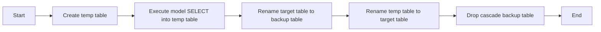

# DBT Proplum
- [DBT Proplum](#dbt-proplum)
  - [Установка](#установка)
  - [Текущий процесс работы dbt ](#текущий-процесс-работы-dbt-)
    - [Полные загрузки ](#полные-загрузки-)
    - [Инкрементальные загрузки](#инкрементальные-загрузки)
  - [Добавленные изменения для реализации proplum](#добавленные-изменения-для-реализации-proplum)
    - [dbt\_load\_info](#dbt_load_info)
    - [external view](#external-view)
      - [Стандартный формат](#стандартный-формат)
      - [Формат для greenplum](#формат-для-greenplum)
    - [FULL](#full)
    - [DELTA UPSERT](#delta-upsert)
    - [DELTA MERGE](#delta-merge)
    - [DELTA](#delta)
    - [DELTA PARTITIONS](#delta-partitions)
  - [Настройка цепочки загрузки.](#настройка-цепочки-загрузки)
  - [P.S.](#ps)

## Установка

Выполнить команды в терминале:
```bash
pip install setuptools
pip install . (В папке с dbt greenplum адаптером)
dbt init (В папке где будет проект dbt.)
dbt run-operation create_load_info_table  (в папке проекта)
```

## Текущий процесс работы dbt <a name="current_dbt"></a>
В этом разделе описание как сейчас работает загрузки без дополнительных разработанных стратегий загрузки.
### Полные загрузки <a name="full_load"></a>

<details>
  <summary>Пример файла модели</summary> 

```SQL
    
        id int4 null,
        descrip varchar(150) null,
        incomingdate timestamp NULL
    


    
        PARTITION BY RANGE (incomingdate)
        (
            START ('2025-04-01'::timestamp) INCLUSIVE
            END ('2025-04-03'::timestamp) EXCLUSIVE
            EVERY (INTERVAL '1 day'),
            DEFAULT PARTITION extra
        )
    
    {{
    config(
        materialized='table',
        schema='dbt',
        distributed_by='id',
        appendoptimized=true,
        orientation='column',
        compresstype='ZLIB',
        compresslevel=1,
        fields_string=fields_string,
        raw_partition=raw_partition
    )
    }}

    with source_data as (

        select 1 as id, 'apple' as descrip, '2022-04-01'::timestamp as part_date
        union all
        select 2 as id, 'banana' as descrip, '2025-04-02'::timestamp as part_date

    )

    select *
    from source_data
```
</details>

Во время фулл загрузки таблицы происходят следующие шаги:
1. Создается *__dbt_tmp таблица с указанной структурой в модели.
2. Выполняется селект написанный в модели и данные вставляются в *__dbt_tmp таблицу. (Если партиций нет в таблице нет, то таблица создается как селект, а не отдельной операцией). 
3. Таблица модели переназывается в *__dbt_backup.
4. Таблица *__dbt_tmp переназывается в таблицу модели. Если есть описания к полям, то после переназвания в таблицу добавляется комменты на поля.
5. Для таблицы *__dbt_backup выполняется drop cascade.
Для первой загрузки, когда таблицы еще нет в db, шаги 3 и 5 пропускаются.  



В конфигурации заполняются следующие параметры:
1. materialized - ставится 'table' для таблиц. Также возможны 'view', 'materialized view', ephemeral (не создается в db, а используется в dbt внутри селектов других моделей), incremental (для загрузок инкремента, подробнее описано ниже).
2. schema - схема в которой создается модель. Если параметр не установлен, то таблица создается в схеме на которую было установлено соединение при создания проекта в dbt.
3.  appendoptimized, orientation, compresstype, compresslevel, blocksize - параметры специфичные для greenplum db. Параметры orientation, compresstype, compresslevel, blocksize применяются только если стоит параметр appendoptimized = true. Для удобства параметры можно заполнять в файле dbt_project сразу для всех моделей внутри папки. Например:
```YML
models:
  projectname:
    # Config indicated by + and applies to all files under models/example/
    example:
      +compresstype: ZSTD
      +compresslevel: 1
      +appendoptimized: true
```
4. distributed_by, distributed_replicated - параметры дистрибуции. Взаимоисключаемые параметры (если заполнены оба, то приоритет на distributed_by). В поле distributed_by заполняется поля, по которым нужно сделать дистрибуцию в таблицу. Если полей несколько, то они заполняются через ',' как текстовой параметр. Например: 'column1, column2'. В distributed_replicated просто ставится true, если требуется чтобы таблица была replicated в db. Если ни один из параметров не заполнен, то дистрибуция делается рандомная.
5. fields_string, raw_partition - настройка партиций в таблице. В raw_partition указывается настройки партиций как sql при создание таблицы в db. fields_string должен быть заполнен если используется партицию в модели и содержит в себе список всех полей в таблице с синтаксисом как в create table. Вместо raw_partition также можно использовать параметры: partition_type, partition_column, default_partition_name, partition_start, partition_end, partition_every, partition_values. Этими параметры можно также собрать настройку партиций таблицы. Но через raw_partition более прямолинейно настройка партиций.
    > [!NOTE]  
    > fields_string можно пропустить в описание модели, но это может сказаться на производительности. Без введенного fields_string создается сначала temp таблица из написанного sql, на основе которой создается целевая таблица и данные из temp таблицы вставляются в целевую. С fields_string данные из написанного sql напрямую вставляются в целевую таблицу, без создания temp таблицы.

<details>
  <summary>Возможные пути улучшения 🟢</summary>

  1.  Мне не нравится, что fields_string приходится заполнять для таблиц с партициями. Может можно как-то получить структуру таблицы сразу из select? 🟢Сделал вариант реализации. Проблема в том, что в этом варианте создается сначала temp таблица из написанного sql и затем создается целевая таблица со структурой из temp таблицы и данные из temp таблицы вставляются в целевую. Т.е. одна лишняя операция происходит, что может ухудшить производительность. Поэтому оставил возможность ввода field string. Новый метод больше как опциональный для таблиц где строк не много и одно дополнительное перекладывания данных не сильно влияет.
  
  2. Для параметров  appendoptimized, orientation, compresstype, compresslevel, blocksize я удалил значения по умолчанию. Чтобы таблицы создавались по умолчанию с параметрами как они настроены. Можно еще добавить эти параметры в файл dbt_project, чтобы оттуда пользователь мог управлять этими настройками по умолчанию. 🟢 Не стал менять создаваемый по умолчанию файл dbt_project. Вместо этого я добавил дополнительное описание для этих параметров с примером для . 
</details>

### Инкрементальные загрузки 

<details>
  <summary>Пример файла модели</summary> 

```SQL
    {{
    config(
        materialized='incremental',
        schema='dbt',
        appendoptimized=true,
        orientation='row',
        compresstype='ZSTD',
        compresslevel=1,
        incremental_strategy='append' 
    )
    }}

    select * from {{ ref('delta_exter') }}
    
    WHERE 1=1
    
```
</details>

Для инкрементной загрузки нужно указать materialized='incremental', вместо 'table'. Логика загрузки зависит от выбранной incremental_strategy (по умолчанию работает по логике append (см. ниже), если параметр unique_key не заполнен. Если unique_key заполнен, то используется delete+insert). В первой раз выполнения модели (пока таблицы модели нет еще в db) происходит по логике фулл загрузки. При повторном выполнение модели начинает выполняться логика выбранной инкрементальной логики. Для разграничения инкрементальной и фулл логики в модели можно использовать макрос is_incremental() (см. пример выше).
По умолчанию в greenplum адаптере реализованы 3 логики:
1. append. В этой логике выполняется селект написанный в модели и результат кладется в temporary таблицу *__dbt_tmpxxxxxxxxxx. Поля temporary таблицы и таблицы модели сравниваются и в таблицу происходит модели происходит insert из temporary таблицы.
2. delete+insert. Требуется заполнение параметра unique_key. В этой логике данные сначала кладутся в *__dbt_tmpxxxxxxxxxx, затем по ключу определенному в unique_key удаляются данные в целевой таблице модели, которые присутствуют в таблице *__dbt_tmpxxxxxxxxxx и данные из *__dbt_tmpxxxxxxxxxx вставляются в целевую таблицу модели.
3. truncate+insert. В этой логике данные сначала кладутся в *__dbt_tmpxxxxxxxxxx, затем выполняется truncate на целевую таблицу модели и данные из  *__dbt_tmpxxxxxxxxxx вставляются в целевую таблицу модели.

## Добавленные изменения для реализации proplum

В рамках доработки адаптера для greenplum была добавлена функциональность аналогичной реализованной в проекте proplum. Вместо функций реализованных в db для proplum мы добавляем макросы, которые выполняют схожую функциональность, но с учетом специфики работы dbt.

### dbt_load_info

Мы добавляем модель, которая в проекте для greenplum db будет по умолчанию. В данной модели хранятся логи выполнения загрузок, которые выполняются методами proplum. (Эта модель аналог таблицы etl.load_info в greenplum proplum).

<details>
  <summary>Модель dbt_load_info</summary> 

```SQL
    {{
    config(
        materialized='table',
        schema='dbt_etl'
    )
    }}

    SELECT
        CAST(NULL AS text) as invocation_id,
        CAST(NULL AS text) as object_name,
        CAST(NULL AS int8) as status,
        CAST(NULL as timestamp) as extraction_from,
        CAST(NULL as timestamp) as extraction_to,
        CAST(NULL as timestamp) as updated_at,
        CAST(NULL as timestamp) as created_at,
        CAST(NULL as timestamp) as extraction_from_original,
        CAST(NULL as timestamp) as extraction_to_original,
        CAST(NULL as text) as model_sql
    WHERE 1=0
```
</details>

Поля таблицы:
1) invocation_id. Это внутренний параметр dbt, который уникален в рамках выполнения одной команды dbt run. Этот параметр также в заголовке логов в файле dbt.log. В рамках proplum мы используем этот параметр как связь между загрузками разных моделей внутри одного выполнения dbt run. Поле аналог load_id из таблицы etl.load_info в greenplum proplum.
2) object_name. Имя модели для которой выполняется загрузка. 
3) status. Значения: 1 - Определен период загрузки. 2 - загрузка выполнена в целевую модель.
4) extraction_from, extraction_to. Период за который выполняется дельта загрузка в прогоне dbt run.
5) extraction_from_original, extraction_to_original. Период за который изначально происходила загрузка в целевую модель. Отличается от extraction_from, extraction_to тем что, после загрузки в целевую модель extraction_to обновляется по последней дате в целевой модели для поля которого используется как поле дельты.
6) created_at, updated_at. Поля создания записи в таблице и последнего обновления этой записи. 
7) model_sql. Здесь хранится sql с select, который забирается для загрузки в целевую таблицы модели с датами, которые получились при расчете периода дельты. 
8) load_method. Совпадает с параметром c таким же именем в настройках для external table. См. [Формат для greenplum](#формат-для-greenplum).
9) extraction_type. Совпадает с параметром c таким же именем в настройках для external table. См. [Формат для greenplum](#формат-для-greenplum).
10) load_type. Имя incremental_strategy proplum, которая используется для загрузки модели.
11) row_cnt. Количество строк в temp таблице, полученные после выполнения SQL написанного в модели.
    
<details>
  <summary>Доработки для dbt_load_info 🟡</summary>

  
    1) Надо добавить создание dbt_load_info при старте проекта. При этом если таблица уже есть в bd, то она не должна удаляться. Можно переделать вместо модели на макрос. 🟢 Сделал макрос create_load_info_table и добавил описание его использования в новый раздел installation. На старт проекта нет hook, так что это вроде самый простой вариант.
    2) Добавления полей load_method, extraction_type, load_type, row_cnt. 🟡 Добавил эти поля, но с изменением что row_cnt - это не кол-во измененных строк в целевой таблице, а кол-во строк изначально забранных для модели. Изменил, потому что кол-во строк для целевой модели нельзя сохранить нигде во время выполнения финального sql. Можно обойти это, но будет не очень красивый sql.
    3) object_name содержит только имя таблицы, без схемы. В dbt вообще нельзя сделать несколько моделей с одним и тем же именем в разных схемах. 🟡 Это больше как примечание. Саму проблему решить нельзя в рамках dbt.
    4) В status 2 значение пропущено. Либо придумать когда его вставлять или 3 переделать в 2.   🟡 Переделал 3 на статус 2. Можно было бы еще поставить 2 статус в начале макросов incremental strategy. Но для этого нужно будет commit делать после этого, чтобы увидеть разницу. Это только помешает, так как если загрузка не прошла лучше, чтобы rollback происходил всех операций.
    5) Для поля updated_at обновление обычно происходит при смене статуса 1 на 3. Но дата ставится на момент открытия транзакции для начала загрузки в таблицу модели. Поэтому поле updated_at не отображает реальную дату обновления. 🟡 Наверное можно оставить как есть?

</details>


### external view

Для выполнения загрузок proplum добавлена функциональность создания моделей с материализацией вида external_table. Возможно 2 формата создания external table в dbt. Первый вариант- это создание external table, которая не планируется использовать в proplum или в ней не требуется функциональность дельты для загрузки методами. Второй вариант - это создание external table, которая содержит дополнительные параметры для загрузок дельты внутри proplum.

#### Стандартный формат

<details>
  <summary>Стандартный формат для external_table</summary>

```SQL
    {{ config(
        materialized='external_table',
        connect_string="LOCATION ('address_of_source_table') ON ALL 
            FORMAT 'CUSTOM' ( FORMATTER='pxfwritable_import' ) 
            ENCODING 'UTF8'",
        columns="""
        n_nationkey int4,
        n_name text,
        n_regionkey int4,
        n_comment text
        """,
        schema='stg_dbt'
    ) }}

    select 1 
```
</details>

Параметры:
1) materialized. Ставится 'external_table'.
2) connect_string. Строка соединения, по которой проходит подключение к данным к внешней системе и забор данных.
3) columns. Список полей и их типов, которые должны быть в external table.
4) Для моделей dbt требуется, чтобы был всегда какой-то селект написан, поэтому мы заполняем "select 1". Вместо этого может быть любой селект. Он не влияет на работу модели.

При выполнение модели проверяется, есть ли уже такая external table в системе. Если есть, то она удаляется и вместо нее создается новая external table c синтаксисом:
```SQL

CREATE READABLE EXTERNAL TABLE <<model name>>
       <<Значение из columns>>
       <<Значение из connect_string>>
```
#### Формат для greenplum

<details>
  <summary>Формат для external table для greenplum</summary>

```SQL
    {{ config(
        materialized='external_table',
        connect_string="address_of_source_table",
        columns="""
        c_custkey int8,
        c_mktsegment text,
        c_nationkey int4,
        c_name text,
        c_address text,
        c_phone text,
        c_acctbal numeric,
        c_comment text,
        c_modifiedts timestamp
        """,
        schema='stg_dbt',
        load_method = 'pxf',
        extraction_type = 'DELTA',
        model_target = 'customer',
        delta_field = 'c_modifiedts',
        safety_period = '0 days'
    ) }}

    select 1 
```
</details>

Для использования external tables в proplum мы добавляем параметры, которые позволяют определять дельту загрузки.

Параметры:
1) model_target. Целевая модель в которую будет загрузка в процессе dbt run, после выполнения создания external table. Наличия этого параметра меняет формат external table на формат для proplum и добавляет логирование в dbt_log_info при выполнения модели.
2) load_method. Определяет как обрабатывать connect_string. Для значений 'gpfdist', 'odata', 'odata2', 'zservice', 'zservice_async' и незаполненного load_method connect_string берется без изменений. Для 'pxf' к connect_string добавляется выражение "ON ALL FORMAT 'CUSTOM' ( FORMATTER='pxfwritable_import' ) ENCODING 'UTF8'" и если extraction_type = 'DELTA', то также добавляется условие на партицирование для поля из delta_field.
3) extraction_type. FULL или DELTA. Для DELTA и load_method = 'pxf' дополнительно рассчитывается условие на партицирование на поле delta_field для connect_string.
4) delta_field. Заполняется для extraction_type = DELTA. Поле в таблице, на которую нужно накладывать дельты ограничения в создание соединения с внешней системы. 
5) safety_period. Заполняется для extraction_type = DELTA. Сдвигает начальную дату периода дельты загрузки на указанных период. Формат: "x days" или "x months" (например "5 days" или "2 months"). Для months используется приближение, что 31 days in 1 month.
6) node_cnt. Количество периодов на которые партицируется период экстракции данных.
7) load_interval. Корректирует период дельты загрузки. Возможные форматы: 'x months' - Ставит начальную дата на начало месяца и сдвигает конечную дату на 31x дней от начало месяца в конечной дате; 'x days' - Ставит начальную дата на начало дня и сдвигает конечную дату на 1 день от начала даты в конечной дате; 'x years' - Ставит начальную дата на начало года и сдвигает конечную дату на 365x дней от начало года в конечной дате; 'x hours' - Ставит начальную дата на начало часа и сдвигает конечную дату на x часов от начало часа в конечной дате.
8) delta_start_date. По умолчанию 200-01-01. Дата от который выполняется дельта загрузки, если еще нет записей по дельте загрузки.


Процесс создания external table для дельты загрузки (для случая с extraction_type = 'DELTA' и load_method = 'pxf'):
1) Считается период за который нужно будет считать дельту. Для этого сначала считывается максимальная extraction_to из dbt_load_info с status = 2 и object_name = model_target. Получившаяся дата считается началом периода загрузки дельты и текущая дата концом периода загрузки дельты. Получившийся период корректируется на  safety_period и load_interval. 
2) Период записывается затем в dbt_load_info на object_name = model_target и status = 1. Если после модели external table будет выполняться модель из model_target, то эта модель сможет получить рассчитанные даты. 
3) Период добавляется к connect_string для партицирирования. Период одной партиции = Весь период дельты / node_cnt.
4) Создается external таблица с полученным connect_string.

<details>
  <summary>Доработки для external tables 🟡</summary>

    1) Добавить остальные load_method  🟡 Добавил дополнительные load_method в обработке. В greenplum db больше обработок, но по сути для остальных выдается либо ошибка или пропуск создания external tables.
    2) убрать extraction_type FULL ? Так как без него по сути загрузка как для обычного формата external table. 🟢 Оставил, но указал, что это настройка строго для load_method = 'pxf' и определения connect_string. 
    3) Я убрал extraction_type PARTITION, так как по сути это тоже самое что DELTA. Но берутся другие поля из objects. Но так как мы проставляем сами в модели настройки, то нет смысла разграничивать эти настройки. 🟢 Тут доработок не требуется
    4) range в партиции сейчас в формате days. Надо проверить на формат с часами тоже, что все правильно обработает, включая load_interval c форматом 'x hour' 🟡 Партиций по часам нет в greenplum db тоже. load_interval c форматом 'x hour' работает.
    5) Для load interval в формате day меня логика смущает. Вообще вся логика мне смущает (может я неправильно реализовал?). 🟡 В greenplum db было неправильная логика для дней. В dbt поправил, в db поправлю 
    6) Я выполняю commit в конце логике. Наверное возможно это обойти и сделать чтобы sql создания сохранялся в target папке. 🟡 Надо сравнивать с логикой в в файле venv\Lib\site-packages\dbt\include\global_project\macros\materializations\models\table.sql . Там тоже есть commit, так что все правильно. Можно подумать в сторону наведения красоты аналогично тому файлу. Например добавить pre-hook и post-hook. 

</details>

### FULL

<details>
  <summary>Формат для full загрузки в proplum</summary>

```SQL
     {{ config(
         materialized='incremental',
         incremental_strategy='proplum_full',
         schema = 'dbt',
         tags=["nation","tpch"],
         appendonly = true,
         orientation = 'column',
         compresstype = 'zstd',
         compresslevel = '1',
         distributed_replicated = true
     ) }}

     select 
         CAST(n_nationkey AS int4) as nationkey,
         CAST(n_name as bpchar(25)) as name,
         CAST(n_regionkey as int4) as regionkey,
         CAST(n_comment as text) as comment 
         from {{ref('ext_nation')}}
```
</details>

При фулл загрузки не требуется никаких дополнительных параметров. Достаточно указать incremental_strategy='proplum_full'. Удобно обобщать создания external table и загрузки данных в целевую модель одним и тем же tags. Чтобы можно было перезагружать таблицы выполняю команду dbt run --select tag:XXXX. Важно помнить, что логика из incremental_strategy срабатывает только со второго выполнения модели. В первый раз выполняется загрузка как для materialized='table'. Что бы не перегружать 2 раза данные можно добавить условие:
```SQL

and 1=1

and 1=0

```
Это позволит пропустить первую загрузку в модели.

Процесс загрузки для фулл логики:
1) Выполняется селект описанный в модели и результат кладется в temp таблицу. Этот процесс одинаковый для всех incremental_strategy и выполняется до работы логики описанной в макросах для incremental_strategy.
2) Создается дельта таблица. Она создается под именем delta_<имя модели> в схеме stg_<имя схемы в модели>. Ее структура совпадает со структурой целевой таблицы модели. Если таблица уже существует, то она сначала удаляется.
3) Данные из temp таблицы перекладываются в дельту таблицу.
4) Создается backup таблица.  Она создается под именем bkp_<имя модели> в схеме stg_<имя схемы в модели>. Ее структура совпадает со структурой целевой таблицы модели. Если таблица уже существует, то она сначала удаляется.
5) Данные из целевой таблицы модели вставляются в backup таблицу.
6) Выполняется truncate целевой таблицы модели.
7) Данные из дельты таблицы перекладываются в целевую таблицы модели.
8) Выполняется ANALYZE целевой таблицы модели. Эту операцию можно пропустить, если в конфигурации модели поставить параметр analyze = false. 
9) Обновляется таблица dbt_load_info. Для модели вставляется строка со статусом 3 и периодом с extraction_to = текущий timestamp.

```mermaid
flowchart LR
    A[Start] --> B[Create temp table]
    B --> C[Execute model SELECT into temp table]
    C --> D[Create delta table]
    D --> E[Insert from temp table to delta table]
    E --> F[Create backup table]
    F --> G[Insert from target table to backup table]
    G --> H[Truncate target table]
    H --> I[Insert from delta table to target table]
    I --> K[Analyze target table]
    K --> L[Log result to dbt_load_info]
    L --> M[End]
```



<details>
  <summary>Доработки для full логики 🟡</summary>

  1) Нужен наверное upsert в dbt_load_info, сейчас insert, что может создать 2 записи для одной модели и одной загрузки. Или можно не ставить при FULL загрузке запись в логи в external table. 🟡 - В итоге 2 вариант вроде лучше. Пользователь может не заполнять model_target и тогда дублирования записей не будет. Если model_target заполнена, а в целевой модели full загрузка, то лог из external таблицы не влияет на full загрузку, так что нормально что 2 отдельные записи в этом случае. 
  2) Таблица дельты может быть лишняя. Так как получается, что есть tmp таблица еще в dbt и это как будто бы повторение. Но с другой стороны tmp таблица не сохраняется. 🟡 Оставлю с дельтой таблицей. 
  3) Убрать возможность указывания delta_field? Кажется лишнее.  🟢 Убрал обработку для delta_field. 

</details>

### DELTA UPSERT

<details>
  <summary>Формат для delta upsert загрузки в proplum</summary>

```SQL
     {{ config(
         materialized='incremental',
         incremental_strategy='proplum_delta_upsert',
         schema = 'dbt',
         tags=["customer","tpch"],
         appendonly = true,
         orientation = 'column',
         compresstype = 'zstd',
         compresslevel = '1',
         distributed_by = 'custkey',
         merge_keys=['custkey'],
         delta_field = 'modifiedts'
     ) }}


     select 
         CAST(c_custkey as int8) as custkey,
       CAST(c_mktsegment as varchar(10)) as mktsegment,
       CAST(c_nationkey as int4) as nationkey,
       CAST(c_name as varchar(25)) as name,
       CAST(c_address as varchar(40)) as address,
       CAST(c_phone as varchar(15)) as phone,
       CAST(c_acctbal as numeric(19,4)) as acctbal,
       CAST(c_comment as text) as comment,
       CAST(c_modifiedts as timestamp) as modifiedts
         from {{ref('ext_customer')}}
     where 1=1
     
     {{ filter_delta() }}
     
```
</details>

Этот метод используется для загрузки дельты в модель с сохранением уже загруженных данных. При загрузке удаляются в целевой таблице строки с ключами совпадающими с ключами пришедшими дельты и затем данные из дельты вставляются в целевую таблицу.

Параметры:
1) В incremental_strategy ставится  'proplum_delta_upsert' для выбора этого метода загрузки.
2) merge_keys - уникальный ключ таблицы. 
3) delete_duplicates - флаг нужно ли удалять дубликаты ключей в данных взятых из источника. По умолчанию false. При удаление дубликатов остается запись с последний значением в delta_field. 
4) delta_field - поле в целевой модели на которое накладывается дельта условие.  
5) Для загрузки с дельтой во времени инкрементальной загрузки (is_incremental()=true) нужно добавлять макрос filter_delta(source_column, log_dates=false) после where условия в написанном селекте (если ограничение на where не нужно, то нужно поставить 1=1 для работы filter_delta). Этот макрос добавляет в условие where ограничение дельту в датах. Тут возможно 2 варианта:
   1)  Загрузка происходит из external из таблицы, которая создалась в "Формате для greenplum" и ее создание происходит внутри одного dbt run. В этом случае параметры для макроса filter_delta не заполняются. При такой настройки макрос возьмет даты записанные в dbt_load_info при работе модели для external table и построит дельту на основе них.
   2)  Если загрузка не из external table в "Формате для greenplum", то в source_column ставится поле на которое будет использоваться как поле дельты в источнике, log_dates = true. Последний параметр сделает что расчет периода дельты происходит не в момент работы модели источника, а в момент запуска целевой модели. Если в параметрах модели есть параметры safety_period и load_interval, то при расчете дельты используется та же логика смещения дат, что и для external tables ([Формат для greenplum](#формат-для-greenplum))
      
При наличие filter_delta для загрузки фиксированного периода вместо дельты в команду dbt run нужно добавить переменные start_date and end_date. Например:
```bash
dbt run --select tag:tag_example --vars '{"start_date": "2025-01-01", "end_date": "2025-12-31"}'
```
Или для формата с часами:
```bash
dbt run --select tag:tag_example --vars '{"start_date": "2025-01-01T08:00:00", "end_date": "2025-12-31T12:00:00"}'
```
При этом если load_interval и safety_period проставлены (см. [Формат для greenplum](#формат-для-greenplum)), то эти настройки применятся к присланным датам.
Также если требуется сбросить текущее состояние дельты (например, при изменения структуры модели), то можно использовать макрос clear_delta_load_info. На него подается имя модели (model_name) и опционально дата после которой нужно удалить логи (на основе даты создания записи) (cutoff_date). Пример использования:
```bash
dbt run-operation clear_delta_load_info --args '{"model_name": "model_example", "cutoff_date": "2025-01-01"}'
```

Процесс загрузки для delta upsert логики:
1) Выполняется селект описанный в модели и результат кладется в temp таблицу. Если в temp таблице 0 записей, то шаги 4-6 будут пропущены.
2) Создается дельта таблица. Она создается под именем delta_<имя модели> в схеме stg_<имя схемы в модели>. Ее структура совпадает со структурой целевой таблицы модели. Если таблица уже существует, то она сначала удаляется.
3) Данные из temp таблицы перекладываются в дельту таблицу.
4) Из целевой таблицы удаляется записи, которые есть в дельте таблице. Используя merge_keys как уникальный ключ в таблице.
5) Данные из дельты таблицы вставляются в целевую таблицу. Если стоит флаг delete_duplicates в настройках, то из дельты таблицы убираются дубликаты при вставке в целевую таблицу.
6) Выполняется ANALYZE целевой таблицы модели. Эту операцию можно пропустить, если в конфигурации модели поставить параметр analyze = false. 
7) В таблице dbt_load_info обновляется статус загрузки. В поле extraction_to ставится максимальное значение из поля delta_field в дельте таблице, в status ставится 2, в model_sql ставится селект используемый для создания temp таблицы.

```mermaid
flowchart LR
    A[Start] --> B[Create temp table]
    B --> C[Execute model SELECT into temp table]
    C --> D[Create delta table]
    D --> E[Insert from temp table to delta table]
    E --> H[Delete records from target table that exist in delta table]
    H --> I[Insert from delta table to target table]
    I --> K[Analyze target table]
    K --> L[Log result to dbt_load_info]
    L --> M[End]
```



<details>
  <summary>Доработки для delta upsert логики 🟢</summary>

  1) Можно where_condition убрать наверное. Его пользовать может напрямую в селект записывать. 🟢 Убрал. Упоминание из  инструкции тоже убрал.
  2) analyze_table table нужно скоординировать с full загрузкой. Чтобы одинаковая была логика. Наверное как в этой логики сделано лучший вариант. 🟢 Создал macros и вставил во все методы proplum для одинаковой логики.
  3) дельта поле в источнике в filter_delta можно не передавать, если добавить его в dbt_load_info (так как он должен быть заполнен в external таблицы). this также можно наверное опустить (должна быть какая-то системная переменная под это). Остается только log_dates параметр и определения для него source_column (наверное в этом случае можно считать из config).  🟢 Убрал лишние параметры в макросе
  4) Может не делать merge_keys как array. Он похоже единственный array получился в параметрах. Все остальное text c , (или может наоборот все остальное переделать на array). Еще может имеет смысл переназвать в unique_key, так как в delete+insert по сути аналог этого метода и там он так называется. 🟢 - tags также array и пусть лучше имя совпадает с proplum db
  5) Для extraction_to обновления меня смущает, что макс значение берется из дельты таблицы. Что если записей 0 придет? 🟢 Поставится null значение. И в последующих загрузках проигнорирует.
</details>

### DELTA MERGE

<details>
  <summary>Формат для delta merge загрузки в proplum</summary>

```SQL
      
      PARTITION BY RANGE(partkey) 
          (
          DEFAULT PARTITION def  WITH (appendonly='true', orientation='column', compresstype=zstd, compresslevel='1') 
          );
      

      
      	partkey int8 NULL,
      	suppkey int4 NULL,
      	supplycost numeric(19, 4) NULL,
      	availqty int4 NULL,
      	comment text NULL,
      	modifiedts timestamp NULL
      

      {{ config(
          materialized='incremental',
          incremental_strategy='proplum_delta_merge',
          schema = 'dbt',
          tags=["partsupp","tpch"],
          appendonly = true,
          orientation = 'column',
          compresstype = 'zstd',
          compresslevel = '1',
          merge_keys=['partkey','suppkey'],
          delta_field = 'modifiedts',
          raw_partition=raw_partition,
          fields_string=fields_string,
          distributed_by = 'partkey, suppkey'    
      ) }}


      select 
      	CAST(ps_partkey as int8) as partkey,
      	CAST(ps_suppkey as int4) as suppkey,
      	CAST(ps_supplycost as numeric(19,4)) as supplycost,
      	CAST(ps_availqty as int4) as availqty,
      	CAST(ps_comment as text) as comment,
      	CAST(ps_modifiedts as timestamp) as modifiedts
          from {{ref('ext_partsupp')}}
      where 1=1
      
      {{ filter_delta() }}
      
```
</details>

Этот метод используется для загрузки дельты в модель с сохранением уже загруженных данных. Отличие от метода delta upsert в том, что обновление происходит с помощью подмены дефолтной партиции. Поэтому для работы логики delta merge требуется, чтобы в целевой модели таблицы была определена дефолтная партиция (и только она). Во время работы delta merge логики собирается таблица буфера, которая содержит в себе комбинацию данных дельты и целевой таблицы, и затем происходит подмена дефолтной партиции в целевой таблицы с таблицей буфера.

Параметры логики совпадают с параметрами для логики delta upsert. Разница в том, что нужно в incremental_strategy поставить proplum_delta_merge и в модели таблицы должна быть объявлена дефолтная партиция (и должен быть заполнен fields_string, так как он требуется для работы партиций). 

Процесс загрузки для delta merge логики:
1) Выполняется селект описанный в модели и результат кладется в temp таблицу.
2) Создается дельта таблица. Она создается под именем delta_<имя модели> в схеме stg_<имя схемы в модели>. Ее структура совпадает со структурой целевой таблицы модели. Если таблица уже существует, то она сначала удаляется.
3) Данные из temp таблицы перекладываются в дельту таблицу.
4) Создается буфер таблица. Она создается под именем bfr_<имя модели> в схеме stg_<имя схемы в модели>. Ее структура совпадает со структурой целевой таблицы модели. Если таблица уже существует, то она сначала удаляется.
5) Проверяется есть ли записи в temp таблице. Если нет, то логика далее пропускается до пункта 8.
6) Данные из дельты таблицы и целевой таблицы вставляются в таблицу буфера. Если есть одинаковые ключи в таблице дельты и целевой таблице, то остается только запись из таблицы дельты. Если стоит флаг delete_duplicates в настройках, то при заборе данных из дельты и целевой таблицах удаляются дубликаты в ключах.
7) Идет подмена партиций: вместо дефолтной партиции в целевой таблице идет подмена на таблицу буфера.
8) Выполняется ANALYZE целевой таблицы модели. Эту операцию можно пропустить, если в конфигурации модели поставить параметр analyze = false.  
9) В таблице dbt_load_info обновляется статус загрузки. В поле extraction_to ставится максимальное значение из поля delta_field в дельте таблице, в status ставится 2, в model_sql ставится селект используемый для создания temp таблицы.

```mermaid
flowchart LR
    A[Start] --> B[Create temp table]
    B --> C[Execute model SELECT into temp table]
    C --> D[Create delta table]
    D --> E[Insert from temp table to delta table]
    E --> F[Create buffer table]
    F --> G[Insert from target and delta tables to buffer tables]
    G --> I[Replace default partition of target table with buffer table]
    I --> K[Analyze target table]
    K --> L[Log result to dbt_load_info]
    L --> M[End]
```


<details>
  <summary>Доработки для delta merge логики 🟢</summary>

  1) analyze_table table нужно скоординировать с full загрузкой. Чтобы одинаковая была логика. Тут вообще не используется. (Надо проверить используется ли в функция в db исходных). 🟢 Создал macros и вставил во все методы proplum для одинаковой логики.
  2) Нужно ли удалять буфер таблицу после загрузки? Проверить суффикс, которые используется в функции для нее. 🟢 Я сделал префикс bfr_ здесь и partitions. В proplum bd таблица не удаляется. Поэтому в dbt тоже не удаляем. Работает как бекап. Отличие от greenplum db: там таблица создается в схеме целевой таблицы (у нас в stg_<имя схемы в модели>). И префикс у нее buffer_.
  3) Создания промежуточных таблиц сделать отдельным макросом.  🟢 Сделал макросом create_delta_table
</details>

### DELTA
<details>
  <summary>Формат для delta загрузки в proplum</summary>

```SQL
      
          PARTITION BY RANGE (c_modifiedts)
          (
              START ('2022-01-01'::timestamp) INCLUSIVE
              END ('2023-12-31'::timestamp) EXCLUSIVE
              EVERY (INTERVAL '1 year'),
              DEFAULT PARTITION extra
          );
      

      
      	c_custkey int8 NULL,
      	c_mktsegment text NULL,
      	c_nationkey int4 NULL,
      	c_name text NULL,
      	c_address text NULL,
      	c_phone text NULL,
      	c_acctbal numeric NULL,
      	c_comment text NULL,
      	c_modifiedts timestamp NULL
      

      {{
        config(
          materialized='incremental',
          schema='dbt',
          appendoptimized=true,
          orientation='row',
          compresstype='ZSTD',
          compresslevel=1,
          incremental_strategy='proplum_delta',
          fields_string=fields_string,
          raw_partition=raw_partition,
          partition_by='c_modifiedts',
          delta_field='c_modifiedts'
        )
      }}


      select * from {{ ref('delta_exter') }}
      where 1=1
      
      {{ filter_delta('c_modifiedts', true) }}
      
        AND 1=0
      
```
</details>

Параметры логики:
1) В incremental_strategy ставится  'proplum_delta' для выбора этого метода загрузки.
2) delta_field - поле в целевой модели на которое накладывается дельта условие. 
3) filter_delta. См. описание в delta upsert.
   
Процесс загрузки для delta логики:
1) Выполняется селект описанный в модели и результат кладется в temp таблицу. Если в temp таблице 0 записей, то шаги 4-7 будут пропущены.
2) Создается дельта таблица. Она создается под именем delta_<имя модели> в схеме stg_<имя схемы в модели>. Ее структура совпадает со структурой целевой таблицы модели. Если таблица уже существует, то она сначала удаляется.
3) Данные из temp таблицы перекладываются в дельту таблицу.
4) Проверяем минимальное и максимальное значение поля, которое используется для партицирования, в temp таблице. 
5) В целевой таблице создаются партиции за период определенный в пункте 4, если период попадает в default партицию. Период новых созданных партиций определяется периодом последней определенной партиции: если >=28 и <=31 дней, то период новых партиций 1 месяц; если <28 дней, то период новых партиций 1 день; если >31 и <=92 дней, то период новых партиций 3 месяцев; если >91 дней, то период новых партиций 1 год.
6) Данные из дельты таблицы вставляется в целевую таблицу модели. При этом не осуществляется проверка существует ли данные из дельты таблицы в целевой. Если данные пересекаются в дельте таблице с целевой таблицей, то произойдет дублирование данных.
7) Выполняется ANALYZE целевой таблицы модели. Эту операцию можно пропустить, если в конфигурации модели поставить параметр analyze = false. 
8) В таблице dbt_load_info обновляется статус загрузки. В поле extraction_to ставится максимальное значение из поля delta_field в дельте таблице, в status ставится 2, в model_sql ставится селект используемый для создания temp таблицы.

```mermaid
flowchart LR
    A[Start] --> B[Create temp table]
    B --> C[Execute model SELECT into temp table]
    C --> D[Create delta table]
    D --> E[Insert from temp table to delta table]
    E --> F[Create partitions for delta period in target table]
    F --> I[Insert from delta table to target table]
    I --> K[Analyze target table]
    K --> L[Log result to dbt_load_info]
    L --> M[End]
```



<details>
  <summary>Доработки для delta логики 🟡</summary>

  1) Смущают возможные дублирования. Например, в источнике последняя дата 2025-05-07 10:00:00. Когда данные загрузится в первый раз, то extraction_to будет 2025-05-07 10:00:00 в результате. При повторной загрузке extraction_from будет  2025-05-07 10:00:00 и эта последняя запись опять заберется. И так как в этом load_type данные просто вставляются в целевую таблицу, то запись повторно вставится и задвоится. Как я понял в greenplum db такая же проблема (если это проблема). Может можно сделать параметр, который скажет, что extraction_from использует > , вместо >=.  🟡 - Оставил как есть, так как повторяет логику в proplum db.


</details>


### DELTA PARTITIONS

<details>
  <summary>Формат для delta partitions загрузки в proplum</summary>

```SQL
      
          PARTITION BY RANGE(receiptdate) 
          (
              START ('2020-01-01'::date) END ('2023-01-01'::date) EVERY ('1 year'::interval) WITH (appendonly='true', orientation='column', compresstype=zstd, compresslevel='1'),
              START ('2023-01-01'::date) END ('2023-08-01'::date) EVERY ('1 mon'::interval) WITH (appendonly='true', orientation='column', compresstype=zstd, compresslevel='1'), 
              DEFAULT PARTITION def  WITH (appendonly='true', orientation='column', compresstype=zstd, compresslevel='1')
          );
      

      
      	shipdate date NULL,
      	orderkey int8 NULL,
      	discount numeric(19, 4) NULL,
      	extendedprice numeric(19, 4) NULL,
      	suppkey int4 NULL,
      	quantity int8 NULL,
      	returnflag bpchar(1) NULL,
      	partkey int8 NULL,
      	linestatus bpchar(1) NULL,
      	tax numeric(19, 4) NULL,
      	commitdate date NULL,
      	receiptdate date NULL,
      	shipmode bpchar(10) NULL,
      	linenumber int8 NULL,
      	shipinstruct bpchar(25) NULL,
      	comment text NULL
      

      {{ config(
          materialized='incremental',
          incremental_strategy='proplum_partitions',
          schema = 'dbt',
          tags=["lineitem","tpch"],
          appendonly = true,
          orientation = 'column',
          compresstype = 'zstd',
          compresslevel = '1',
          delta_field = 'receiptdate',
          raw_partition=raw_partition,
          fields_string=fields_string,
          distributed_by = 'orderkey',   
          partition_by='receiptdate',
          merge_partitions=false     
      ) }}


      select 
      	CAST(l_shipdate as date) as shipdate,
      	CAST(l_orderkey as int8) orderkey,
      	CAST(l_discount as numeric(19,4)) as discount,
      	CAST(l_extendedprice as numeric(19,4)) as extendedprice,
      	CAST(l_suppkey as int4) as suppkey,
      	CAST(l_quantity as int8) as quantity,
      	CAST(l_returnflag as bpchar(1)) as returnflag,
      	CAST(l_partkey as int8) partkey,
      	CAST(l_linestatus as bpchar(1)) as linestatus,
      	CAST(l_tax as numeric(19,4)) as tax,
      	CAST(l_commitdate as date) as commitdate,
      	CAST(l_receiptdate as date) as receiptdate,
      	CAST(l_shipmode as bpchar(10)) as shipmode,
      	CAST(l_linenumber as int8) as linenumber,
      	CAST(l_shipinstruct as bpchar(25)) as shipinstruct,
      	CAST(l_comment as text) as comment
          from {{ref('ext_lineitem')}}
      where 1=1
      
      {{ filter_delta() }}
      
      and 1=0
      
```
</details>

Этот метод используется для загрузки дельты в целевую таблицу модели, используя замену партиций вместо вставки напрямую  в таблицу. Метод работает в 2 режимах: с сохранением данных в целевой таблице, если они не пришли из дельты или удалением данных если они не пришли в дельте за период загрузки. Для работы логики требуется, чтобы в модели было определено партицирование. 

Параметры логики:
1) В incremental_strategy ставится  'proplum_partitions' для выбора этого метода загрузки.
2) merge_partitions - Значение true или false. По умолчанию true. Выбор между режимами сохранения данных в целевой таблице (true) за период перегрузки. Или полной перезаписи (false).
3) merge_keys - уникальный ключ таблицы. 
4) delete_duplicates - флаг нужно ли удалять дубликаты ключей в данных взятых из источника. По умолчанию false. ри удаление дубликатов остается запись с последний значением в delta_field.
5) delta_field - поле в целевой модели на которое накладывается дельта условие. 
6) filter_delta. См. описание в delta upsert.

Процесс загрузки для delta partitions логики:
1) Выполняется селект описанный в модели и результат кладется в temp таблицу. Если в temp таблице 0 записей, то шаги 4-11 будут пропущены.
2) Создается дельта таблица. Она создается под именем delta_<имя модели> в схеме stg_<имя схемы в модели>. Ее структура совпадает со структурой целевой таблицы модели. Если таблица уже существует, то она сначала удаляется.
3) Данные из temp таблицы перекладываются в дельту таблицу.
4) Проверяем минимальное и максимальное значение поля, которое используется для партицирования, в temp таблице. 
5) В целевой таблице создаются партиции за период определенный в пункте 4, если период попадает в default партицию. Период новых созданных партиций определяется периодом последней определенной партиции: если >=28 и <=31 дней, то период новых партиций 1 месяц; если <28 дней, то период новых партиций 1 день; если >31 и <=92 дней, то период новых партиций 3 месяцев; если >91 дней, то период новых партиций 1 год.
6) Идем по партициям, которые попадают в период, определенный в пункте 4, с учетом новых созданных партиций в пункте 5.   
7) Создается буфер таблица. Она создается под именем bfr_<имя модели> в схеме stg_<имя схемы в модели>. Ее структура совпадает со структурой целевой таблицы модели. Если таблица уже существует, то она сначала удаляется.
8) Данные из дельты таблицы и целевой таблицы (если стоит флаг merge_partitions) вставляются в таблицу буфера за период партиции. 
   1) Для случая с флагом merge_partitions = true, если есть одинаковые ключи в таблице дельты и целевой таблицы, то остается только запись из таблицы дельты. Если стоит флаг delete_duplicates в настройках, то при заборе данных удаляются дубликаты в ключах.
   2) Для случая с  флагом merge_partitions = false, если стоит флаг delete_duplicates в настройках, то при заборе данных удаляются дубликаты в строках (без использования ключа).
9)  Идет подмена партиций: партиция в целевой таблице подменяется на таблицу буфера. Если в таблице буфера 0 строк, то этот шаг пропускается.
10) Пункты 7-9 повторяются для всех партиций из пункта 6.
11) Выполняется ANALYZE целевой таблицы модели. Эту операцию можно пропустить, если в конфигурации модели поставить параметр analyze = false. 
12) В таблице dbt_load_info обновляется статус загрузки. В поле extraction_to ставится максимальное значение из поля delta_field в дельте таблице, в status ставится 2, в model_sql ставится селект используемый для создания temp таблицы.

```mermaid
flowchart LR
    A[Start] --> B[Create temp table]
    B --> C[Execute model SELECT into temp table]
    C --> D[Create delta table]
    D --> E[Insert from temp table to delta table]
    E --> F[Create partitions for delta period in target table]
    F --> G[Start of loop of partitions in target table for delta period]
    G --> H[Create buffer table]
    H --> I[Insert from target table and delta table to buffer table]
    I --> K[Switch partition of target table with buffer table]
    K --> L[End of loop]
    L --> G
    L --> M[Analyze target table]
    M --> N[Log result to dbt_load_info]
    N --> O[End]
```



<details>
  <summary>Доработки для delta partitions логики 🟡</summary>

  1) Попробовать, чтобы весь селект был в результирующем файле, а не через call sql в макросах 🟡 Не получится переделать. Так как во время работы логики нужно делать решения на основе предыдущего шага (например с числом строк в буфера). Может что-то упускаю.
  2) Убрать partition_field в логике. Похоже не используется. 🟢 Убрал. Видимо partition_key вместо него.
  3) analyze_table table нужно скоординировать с full загрузкой. Чтобы одинаковая была логика. 🟢 Создал macros и вставил во все методы proplum для одинаковой логики.
  4) Почему период мы берем из временной таблицы? Почему не берем напрямую рассчитанный период? Что будет если пустая таблица придет.  🟢 Проговорил с Димой И. и так должно быть. К тому же партиции, к которым не пришли данные пропускаются в расчете и подмене партиций. При пустой temp таблицы вся логика игнорируется.
  5) Удаление буфер таблицы в for происходит 2 раза. Можно одно выбросить из for? 🟢 Переместил первое удаление вне for. Чтобы не повторялось.

</details>

## Настройка цепочки загрузки.
Для выполнения длинных процессов в моделях можно настраивать порядок выполнения моделей используя одинаковое значения в tags для объединения процессов в один и добавления --{{ref('<имя модели>')}} перед селектом для модели. Результат последовательностей моделей можно увидеть, если выполнить в консоле команды:
```bash
dbt docs generate  # Создает документацию к проекты
dbt docs serve  --port 8001    # Запускает веб сервер с документацией на локальном порту 8001
``` 
В загустившемся сервере можно открыть Lineage Graph моделей и выбрать для просмотра нужный таг. получившиеся схема будет соответствовать порядку запуска моделей при выполнения команды:
```bash
  dbt run --select tag:<Таг созданный для цепочки загрузки>
``` 

## P.S.
<details>
  <summary>Общие вопросы по процессу 🔴</summary>

  1) Как перегружать данные с начала (сброс дельты периода)? (сделать макрос под это, который бы удалял данные из dbt_load_info ) - 🟢 Создал макрос и добавил описание в delta upsert
  2) При full-refresh возможно ли dbt_load_info сбросить? (Что делать если структура таблица поменялась) 🟢 Для full-refresh я думаю ничего делать не надо. Вторая половина практически совпадает с 1) вопросом.  
  3) Первая загрузка для дельт таблиц кажется лишней. Можно ли как-то пропускать ее? 🟡 В разделе для FULL есть примечание, что первую загрузку можно пропустить если поставить фильтр 1=0 для not is_incremental(). Пока это наверное достаточно.
  4) Возможность подавать период загрузки из вне как параметры на команду dbt run 🟢 Добавил переменные start_date и end_date в описание к макросу filter_delta. 
  5) Одна функциональность в dbt, которая может мешать нескольким людям работать одновременно в системе: при запуске dbt run проверяются все модели в проекте на корректный синтаксис. И если одна из моделей некорректная то нельзя запустить не одну из моделей.
  6) Упаковать разработки в адаптер. Сейчас они в проекте и макросы не помечены, что они принадлежат только greenplum адаптеру.
  7) Что делать если запустили 2 загрузки dbt run одновременно. Можно ли это поймать и приостановить одну из загрузок?  🟠 - Я добавил макрос generate_lock в начало каждого custom strategy. Он ставит lock с ключом сгенерированным на основе имя модели. Соответственно, если кто-то запустит в параллели загрузку в одну модель 2 раза, то 2 загрузка начнет работать только когда первая дойдет до конца. Проблемы могут быть: 1) с external table, если они в режиме DELTA, так как они запускаются в другой модели 2) в параллельных ручных разработках в базе, если они затрагивают те же таблицы, что используются в модели.
  8) Способ загрузки для v_delta_mode = 'ITER'? (Исходная логика в f_gen_load_id - период загрузки разбивается на интервалы и к каждому периоду создается свой load_id)(Обрабатывается последовательно) 🔴 Dbt не может сам запускать dbt run, поэтому сделать макрос, который последовательно выполнял dbt run моделей за разные периоды нельзя. Скорее всего для таких задач нужно создавать dag в airflow и выполнять там процесс загрузки.
  9) Я записываю в extraction_to max value из целевой таблицы. Правильно ли это? Надо ли писать из дельты (вроде так в greenplum db) 🟢 - Не правильно описал изначально в документации, но в самих макросах  было правильно (бралось из дельты таблицы максимальное значение)
  10) Удалить is_external_table, create_external_table методы из impl.py. они наверное лишние. 🟢 -Удалил
  11) Может для параметров партиций оставить только raw partition. Для остальных параметров есть предупреждение, что они либо устарели или просто не используется вроде (partition_spec?) 🟡 - Я проверил и конфигурация с partition_spec не работает. Я не стал код менять исходный, но добавил предупреждение в исходный README файл, который был в адаптере.
  12) Написать про создание последовательности загрузки. И просмотр ее в документации. 🟢 - добавил новый раздел
  13) При выполнение dbt docs generate заполнилась таблица dbt_info_load. Надо чтобы выполнялся макрос генерации загрузки только для dbt run. 🟢 - Добавил условие execute and not flags.WHICH in ['generate','serve'] в начале макроса filter_delta
  14) Схемки нарисовать процессов. С дельтой и буфер таблиц.  🟢 - added mermaid schemes into md file
  15) Протестировать доработки для airflow которые делали для dbt dbt-af
  16) load_interval и safety_period для случая без external table 🟢 - Уже было, только не описал в документации
  
  🟢 - готово

  🔴 - есть проблемы с решением

  🟠 - можно оптимизировать

  🟡 - готово, но есть сомнения.
 
  ⚪ - не оттестировано до конца
</details>

<details>
    <summary>Новые замечания (30.05.2025)</summary>

1)  distributed tables в инкременте   🟡 - Насколько я понимаю, в incremental для clickhouse хотя и написана логика для distributed, но при вызове методов инкрементов не передается флаг distributed и поэтому в стандартном адаптере clickhouse по сути distributed логика не работает. Поэтому мы можем у себя тоже пока не реализовывать.
2)  В clickhouse если упадет в середени загрузки. Как почистить лишние таблицы? 🟢 - я поменял имя в таблицах, чтобы не использовать invocation id. Это позволит перезаписывать эти таблицы при повторной загрузке. И удалять их при успешной загрузке. 
3)    Сделать проверку перед методами инкрементациями, что все параметры присутствуют. 🟢 - Добавил проверку.
4)    почему extraction_from 1970 в clickhouse?  🟢 - SELECT в clickhouse вместо null возвращает 1970-01-01 для поля даты и при отсутсвие данных. Сделал проверку в коде на 1970-01-01
5)    update partitions в clickhouse сделать просто partitions  🟢 - Обновил
6)    В шаблон к dbt project добавить свойства load_info таблицы  -- 🔴 шаблон находится в include/starter_project/dbt_project. И он видимо общий для всех проектов. Не знаю можно ли тогда менять. 
7)    example models in 🟢 в git добавил example folder
8)   greenplum__get_extraction_dates и clickhouse__get_extraction_dates можно объденить. В них одинаковая логика, кроме вызова log_extraction_dates 🟢 Объединил. Обработка 1970-01-01 только теперь общая. И также нашел, что для greenplum исчез commit после лога статуса 1.
9)    Если назвать в external table statement, то может не нужен фиктивный sql  🟢 - да не нужен
10)     Использовать drop_relation_if_exists для greenplum external table 🟢 Нельзя заменить для greenplum (так как там DROP EXTERNAL). В остальных случаях DROP уже не используется.
11)     Объединить clickhouse__filter_delta с greenplum__filter_delta (только синтакс результирующиго фильтра)
12)    Если есть в логах запись от external table, то делаем upadate вместо insert  в filter_delta 🟢 Уже добавил такое в макрос greenplum__update_load_info_complete
13)    Может переделать акцент в документации на external table. При тестирование они были нужными, но по сути главный функционал про дельту загрузку. Может как раз в случае external table надо заполнять параметры в макрос filter_delta, а для обычной загрузки  параметры не нужны.
14)  автоматически добавлять для период экстракции без использования макроса filter_delta 
15)  таблица сравнения существующих методов и новых в proplum 🟢
16)    cockpit для dbt в proplum
17)    Объединить разные методы clickhouse и greenplum, если они схожи 🟠 По сути в других пунктах уже поправил. Можно еще наверное больше объединить. Большинство не общих методов - это инсерт в логи, где функции текущего времени просто разные в для разных адаптеров 
18)    Добавление партиций для init загрузки 
19)    Что я менял в greenplum функциях из исходного адаптера greenplum
20)    Во всех макросах добавить префикс proplum 🟢
21)    Обновить описания  в файле md 🟢
22)    zsevice и odata. Попробовать подключить его к dbt. (выполнить их в до и после)
23)    Для proplum_partitions убрать вызов incremental_sql и убрать select 1
</details>